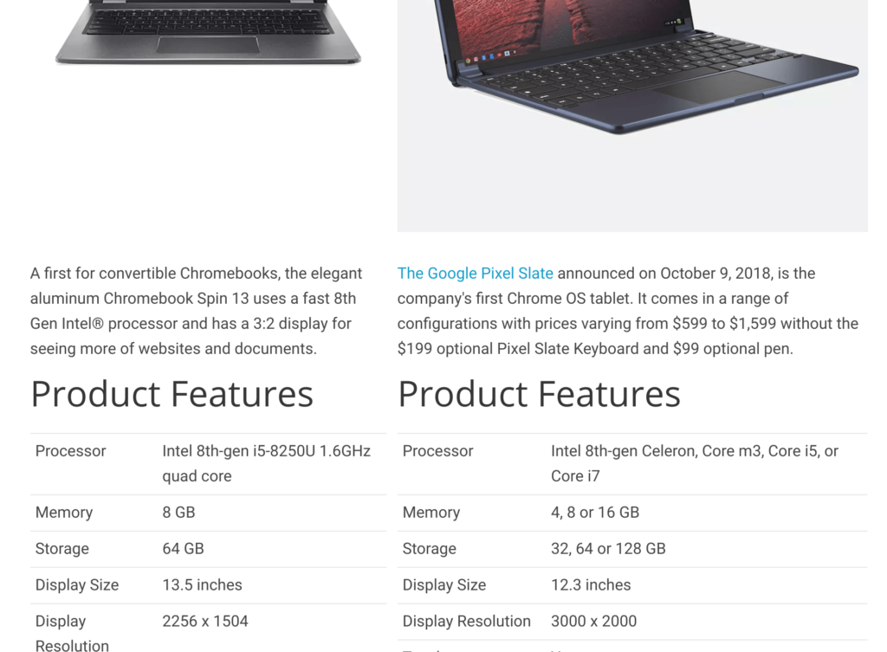

I've been thinking about how to bring more useful information to About Chromebooks and today I implemented the first of several ideas. In the main menu, you'll now see a [Products](https://www.aboutchromebooks.com/products/) option, which brings you to a new Chromebook product database that I've started to put together.

Let's call this beta version 0.1 of the database because I may implement layout and functionality changes. And I only have two products in there so for. But if you hit the new product page, you'll get an idea of where this is heading: One place to view various Chromebook and Chrome tablet specifications, information and a listing of reviews from around the web on these products.

I currently have a method to compare the specifications of two Chrome OS devices as well, but we'll call that beta 0.01.

Here's an example:

I think this one-stop destination is a good idea for readers to find and use information on various devices for making their purchase decisions. I'll know for sure it's a good idea if we see other tech sites implement something similar in the coming weeks and months. ;)

But more importantly, I want to hear from you on if this is a good idea. I'm open to suggestions and ideas, but keep in mind that I may have technical limitations and can't implement all of them. In other words, I'm learning as I go! I'm finishing up the first semester of a Java class right now and HTML/CSS/Javascript is on my upcoming class schedule; first I have to finish Java II though. Once I get some Javascript knowledge, changes will be much easier to implement. (I hope.)

Ideally, I'd like to remove most of the right sidebar on the product pages so you can see more product information on the screen at one time. And along with a comparison tool, my hope is to implement a feature that will let you search for all devices, for example, that have a particular processor or at least 8GB of memory. I think that, along with the aggregated reviews will help people find the best Chrome OS device for them. Let me know if you agree.
