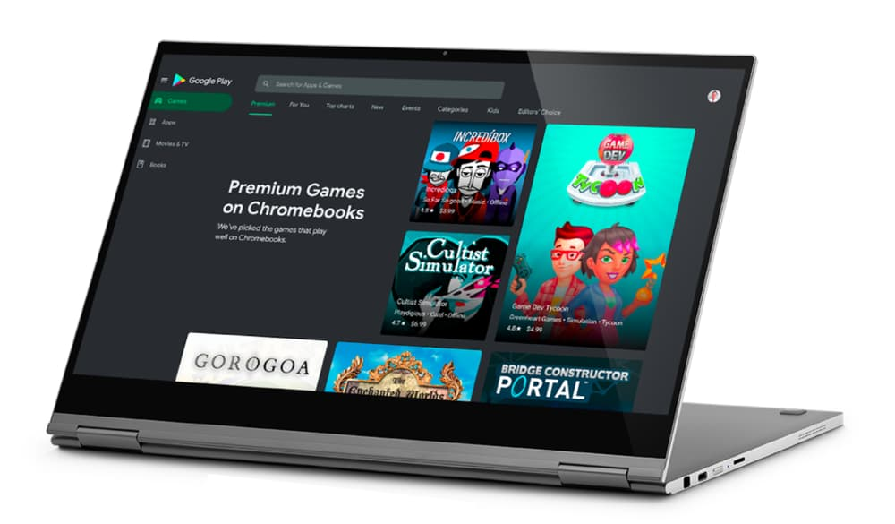
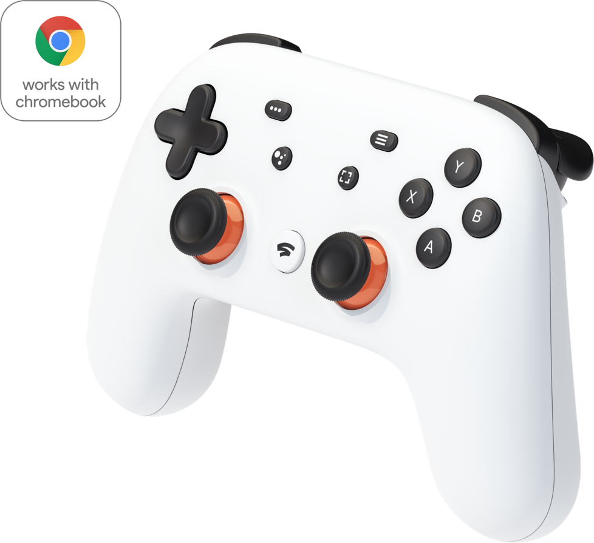

While everyone else is trying (and likely failing) to get a new Nvidia GeForce RTX 3080 card for their gaming PC today, [Google has the spotlight on various game options for Chromebooks](https://blog.google/products/chromebooks/levelling-up-gaming-chromebooks/).

There's a new "Premium Games on Chromebook" section in Google Play, for example, and reminders of two PC game streaming options, one of which has a free, 3-month trial for new Chromebook owners. Why the focus? Google says that gaming time on Chromebooks has nearly tripled over the past three months.

The main new effort here is the Play Store section. To check it out, open the Play Store app on your Chromebook and not the Play Store website. Opening the latter just gets you the generic Play Store.

In the Play Store app, you'll see a new Premium tab; click it and you'll see which games are recommended for Chrome OS playtime.

Keep your expectations in check though: It's not as though this collection is launching with hundreds of options. Still, if curated over time, I could see this being a nice place to check for great titles.

In its blog post, Google also reminds us that Stadia works well on Chromebooks for true PC gaming. And if you haven't tried Stadia yet but [purchased a new Chromebook after June 2017, you can get three free months of Stadia Pro](https://www.aboutchromebooks.com/news/bought-a-chromebook-released-after-july-2017-youve-got-stadia-pro-free-for-three-months/) as a trial.

Of course, you'll want a controller that works with the gaming service: If you need one, Google recommends those with the "Works with Chromebook" tag. Google's own controller has it of course, as does the [Logitech F710 wireless controller](https://www.logitechg.com/en-us/products/gamepads/f710-wireless-gamepad.940-000117.html) and [F310 wireless gamepad](https://www.logitechg.com/en-us/products/gamepads/f310-gamepad.940-000110.html).

Nvidia's GeForceNow is another option too.

I tried it on my Chromebook last week since [a new feature pulls in PC game titles purchased from Steam](https://www.aboutchromebooks.com/news/steam-game-sync-on-geforce-now-for-chromebooks-may-make-it-a-better-option-than-stadia/). I have a few of those and I have to admit: It's nice to be able to stream those top-tier titles on a Chromebook for playback.

Google also reminded Chromebook owners of the perks page that rotates special offers only to Chromebook owners. There are a few gaming titles available now for free, so [hit the perks page up](https://www.google.com/chromebook/perks/) to claim any you might want to play.
