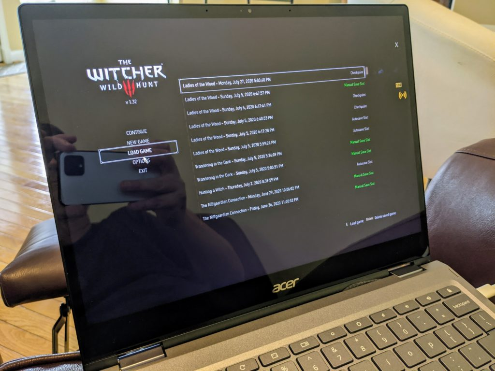

Like many of you probably do, I have a Google News alert set up to ping with new articles about Chromebooks and Chrome OS. And over the 3.5 years of writing this site, I'm thrilled to see the sheer volume of alerts continue to rise. Everyone once in a while though, I read the latest coverage and almost wish I hadn't. One this week is [this one from FossBytes](https://fossbytes.com/reasons-to-buy-a-chromebook/) as Chromebook myths continue because of articles like this.

I'm not trying to call the site or author out here. I appreciate that some effort went into the article, which is titled "5 Reasons to buy a Chromebook (and 3 reasons why you shouldn't)".

There are some completely valid reasons outlined here, on both sides of the fence. And I strongly believe that articles like this are good: Consumers should buy the computing device that best fits their needs. I realize that device isn't always a Chromebook, and that's fine!

But the errors and omissions in this particular article aren't offering the best information for people to make the best device purchase decision.

## Chromeboook myths about productivity software

For example, here's a section of the first "why you should" reason, which discusses the use of Chromebooks for students, content consumption, and general browsing:

> If you’re a student or a working professional and all you do is use Social media, browse stuff on the web, and consume a lot of video content, a Chromebook might be an ideal choice. Similarly, if your day involves juggling between Excel sheets or other documents, a Chromebook is again a great choice. However, bear in mind that there’s no [Microsoft Office](https://fossbytes.com/tag/microsoft-office) suite on Chromebooks. Hence you’ll need to use Google’s cloud-based office suite, which is an excellent alternative to Microsoft Office.

Does anyone else see the problem?

It's the bit at the end about productivity. It's true that there's no Microsoft Office suite on Chromebooks if you specifically mean from a _desktop client_ aspect. And while we did have [Microsoft Office apps for Android that ran on Chromebooks, those are gone too now](https://www.aboutchromebooks.com/news/microsoft-ending-chromebook-support-for-office-android-apps-in-september/). But the "you'll need to use Google's cloud-based office suite" bit is simply not the case.

For example, you can use Microsoft 365, which is the online Microsoft Office product, right in the Chrome browser of a Chromebook. Or you could easily activate Linux in the Chrome OS options and [install one of many Office applications such as LibreOffice](https://www.aboutchromebooks.com/news/how-to-install-libreoffice-for-linux-on-a-chromebook-after-downloading-it-as-a-tar-gz-file/) in under five minutes.

My point is: There are options to use Microsoft Office on a Chromebook or you can find similar alternatives. Yes, I suspect most people will gravitate towards Google Docs on a Chromebook. You won't, however, "need to use Google's cloud-based office suite."

## Chromebook myths about pricing

This one is quite common in many articles are Chromebooks are typically considered "cheap" or "inexpensive". And they can be but not always. Folks who think Google said they would be [are incorrect as I've previously noted](https://www.aboutchromebooks.com/news/chrome-os-is-10-years-old-heres-the-first-demo-from-2009/).

Chrome OS and Chromebooks are built upon three pillars, which are called "the three S's": Speed, Simplicity, and Security. There's no "sInexpensive" pillar. ;)

It just so happens that the first few device life cycles were relatively inexpensive devices as Google built the operating system up over time. To do that, the company targeted inexpensive netbook hardware for testing and maturity.

Now there's a range of devices starting around $200 and going well past $1,000, which the article tried to point out but got a little lost in the "inexpensive" translation:

> I’m pretty sure you saw this coming. Chromebooks are a lot cheaper than Windows laptops and MacBooks. For instance, to buy a good and ‘usable’ Windows machine, you’ll need to shell out at least USD 600, whereas ‘low-specced’ Chromebook prices start at as low as $250. Premium and powerful Chromebooks, on the other hand, will cost you no more than $700.

There are definitely Chromebooks priced about the "will cost you no more than $700" statement in the article. I can give a bit of a pass on this point as perhaps those are the highest-priced configurations in that author's market. But I'd hate to see people buy a mid-range Chromebook for $500 to $600 and think it's as premium as you can go.

Does everyone need to spend that much or buy a truly premium Chromebook with hardware that rivals the best MacBooks or Windows devices? Of course not!

People should know that they can, however, and they should have a clear expectation of what they might pay.

Additionally, I've paid as low as $279 for a Windows laptop in the past. It wasn't the best experience but it got the job done for Microsoft-centric application usage during some of my early classwork. That's another story entirely though.

## Chromebook myths: Windows support is there but it's limited

There's a nice article section on the ability to run Windows on a Chromebook. And it covers what's likely the easiest method: [Using Parallels Desktop to install Windows, which I've done](https://www.aboutchromebooks.com/news/windows-10-on-a-chromebook-a-look-at-parallels-desktop-for-chromebook-enterprise/).

So it's good that people understand if they have to run a Windows application using a Chromebook, there are options.

> Yes! You heard that right. You can run Windows on Chromebook using a VM app called Parallels. We previously covered Parallels in our ‘_[How to install Windows 11 on M1 MacBooks](https://fossbytes.com/how-to-install-windows-11-on-m1-mac-macbook/)_‘ article. One of the unique features of Parallels is, you can directly drag and drop files from Chrome OS to Windows VM and vice versa, which is pretty great.

There are other options, but I won't get into that here. My bigger concern is that there's no mention of the limitation for purchasing and using Parallels Desktop for Chrome OS.

It's an enterprise product and _requires that your Chromebook be managed by an enterprise_. As much as I'd like to see it, most consumers aren't able to use Parallels Desktop for Chrome OS today. Hopefully, that changes in the future but it's useful information to know that right now, this is a current limitation.

## Chromebook myths on gaming

I'll be the first to admit that if gaming is your primary purpose for buying a computer, a Chromebook shouldn't be at the very top of your list.

And the main reason is pointed out in the article:

> As stated earlier, running Windows games on Chrome OS is not possible. Hence, if you want a machine that can game, we’d suggest stick with Windows, at least for now. Also, some of the Android games like Call of Duty and PUBG don’t work on Chrome OS. Hence, you might want to check what runs and then decide if you should buy a Chromebook.

It's also true that if you have an entry-level device, some complex Android games aren't likely to run well, if at all.

But you know what you can do on a Chromebook, even the least expensive models? Play PC game titles that are streamed. This works well on any supported Chromebook because the games are run on powerful cloud servers and you're basically using the Chromebook to interact in near-real-time with that game stream.

I've outlined these experiences [using Google Stadia once it launched](https://www.aboutchromebooks.com/news/google-stadia-gaming-chromebooks-november-release-pricing-chrome-os-preorder/), as well as [playing my Steam titles for PC through Nvidia's GeForce Now service on Chromebooks](https://www.aboutchromebooks.com/news/heres-how-nvidias-geforce-now-speeds-up-fortnite-on-chromebooks/). I do have a gaming PC that I built specifically for gaming, complete with an Nvidia RTX 3080. And I love it for gaming. But I don't love having to sit in my upstairs office to play those games. So I often move downstairs to the couch or a comfortable recliner and play the same games over one of the game streaming services on my Chromebook.

And while it's true that the games aren't actually being **_run_** on a Chromebook, you are **_playing_** them on a Chromebook with either of these or similar, services. We can argue semantics, but to essentially say that you can't game on Chromebooks simply isn't true.

## Chromebook myths on software support

This section of the article may have disappointed me the most because it has both errors and omissions.

Here's what was written about Chromebook software support from Google:

> Windows PCs and Laptops are all upgradeable to the latest Windows 11 using either official or unofficial installation methods, but that’s not the case with Chromebooks. They get around six and a half years of major updates.

There's been a ton of news recently about [how Microsoft is handling the Windows 11 update for new and existing machines](https://www.theverge.com/22643275/windows-11-upgrade-system-requirements-pc-health-check). Technically, there are very specific "official" requirements, which have miffed quite a bunch of people.

And rightly so. Unofficially, you may be able to get the update to run, even on unsupported machines that are only a few years old.

But even if you can, [Microsoft has said that it reserves the](https://www.theverge.com/2021/9/21/22686457/windows-11-health-check-compatible-supported-cpu-old-pc-waiver) right to deny updates to your machine in this case. That's not very clear, nor is it good.

Google at least offers clarity on Chrome OS software updates although it has made changes to its upgrade policy over time.

Originally, there was no policy. [Then it was five years](http://updates four). That eventually [became 6.5 years](https://www.aboutchromebooks.com/news/chrome-os-software-support-dates-extended-for-more-than-130-chromebooks/) and [in January 2020, Google has said that all new Chromebooks will get 8 years of software support.](https://www.aboutchromebooks.com/news/google-announces-8-years-of-chrome-os-software-updates-aue-for-new-chromebooks/)

So the article information is nearly two years out of date and sells software support short by 1.5 years. Additionally, all currently supported Chromebooks show the actual date when their software support expires.

## Chromebook myth-busting

Again, I hate to single out one article. And I don't believe that a Chromebook is the best device for all people. Nor do I believe that my own writing is infallible on these topics; I've inadvertently made my share of mistakes over the years too.

I do, however, believe that after [a decade of Chromebooks](https://www.aboutchromebooks.com/news/10-years-of-chromebooks-and-people-still-dont-know-what-theyre-capable-of/), it's time for people to better understand the actual pros and cons of Chromebooks.
