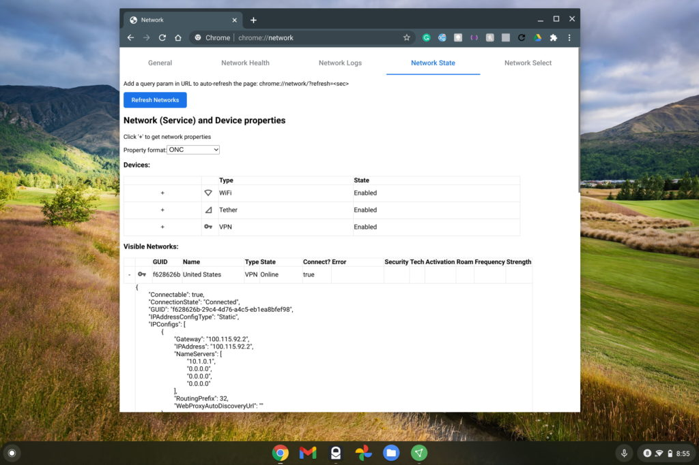

Diagnosing hardware issues on a Chromebook isn't always easy. There are some Chrome apps to help with this, but they're going away. That's the likely reason we've seen [reports of a new native Diagnostics app in Chrome OS](https://chromeunboxed.com/chromebook-diagnostic-app-early-look-cpu-ram-battery) in the works. As part of this effort, [the latest Chrome OS Canary Channel release includes a new Connectivity Diagnostics tool](https://www.androidpolice.com/2020/11/06/google-is-adding-a-new-connectivity-diagnostics-app-to-chromebooks/). It largely appears to be a refresh of a network connection tool you can actually use today on any Chromebook.

Here's a look at the new tool, [reported by Android Police](https://www.androidpolice.com/2020/11/06/google-is-adding-a-new-connectivity-diagnostics-app-to-chromebooks/):

You can see there are various network-related tests here to help identify Chromebook connectivity issues. You can also send feedback reports to Google for examination and (hopefully!) identification of the root cause.

That information is particularly helpful if a large number of connection issues appear on a specific Chromebook model. After resolving the issue, Google could push a software update to those models.

When I saw the above example above, I actually thought it looked familiar. Indeed, I've used a special Chrome OS URL to do some network diagnostics in the past, and you can too, even before the updated tool arrives.

Just head over to `chrome://network` where you'll see several tabs of information, including one called "Network Health" that has the same tests.

That screen is the one that most Chrome OS users would need to identify potential network issues. If you really want to dig down and too see detailed data, you can see it in the Network State tab:

In the above picture, I'm specifically not expanding too much of the connection data since it shows my Chromebook's unique MAC address identifier. But there's plenty of data there as well as in the Network Logs tab, which lists each and every network action a Chromebook takes at the hardware level.

So the new tool appears to be a fresh coat of paint on the existing Network Diagnostics. That's fine with me if the tool becomes more accessible and focuses on the basics needed to troubleshoot a Chromebook network connection.
