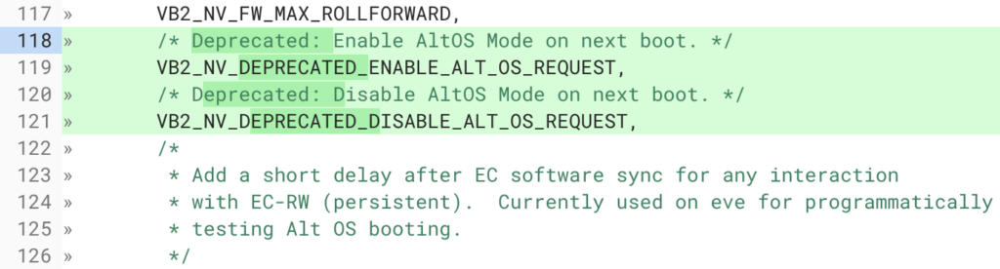
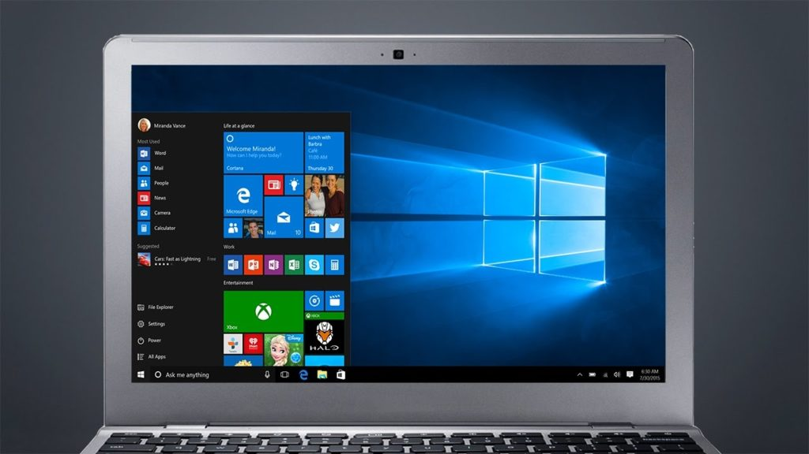

[Project Campfire turned up in the Chromium world](https://www.xda-developers.com/chromebooks-chrome-os-windows-10-dual-boot-apple-boot-camp-campfire/) this past August. The intent was to let a Chromebook boot not just into Chrome OS but directly into another operating system such as Linux or Windows. I thought the latter was a positive outcome since it would [allow Chromebooks to natively run Windows desktop apps on a Chromebook, and add value to devices](https://www.aboutchromebooks.com/news/run-windows-on-a-chromebook-great-idea/).

Unfortunately, the project is shutting down.

[Spotted in code by Redditor u/crosfrog](https://www.reddit.com/r/Crostini/comments/bon7yv/has_alt_os_dual_boot_campfire_been_scrapped/), there are comments and code removals that make it clear [Project Campfire is being deprecated](https://chromium-review.googlesource.com/c/chromiumos/platform/vboot_reference/+/1588026).

The above screenshot is one of several examples where the Campfire code is essentially being disabled. While I wouldn't expect Google to announce the closing of Project Campfire, since it never officially announced it in the first place, it's evident that at least for now, Chromebooks aren't going to natively boot into Windows.

I'm not _completely_ surprised by this development, mainly because I've been watching for progress on Project Campfire. At first, there was plenty: [new boot menu options](https://www.aboutchromebooks.com/news/chromebooks-campfire-altos-windows-keyboard-shortcut-pixelbook-2-eve/), for example, and [icons to select your operating system of choice](https://www.aboutchromebooks.com/news/project-campfire-alt-os-dual-boot-windows-10-chromebooks-linux/). But all of that activity was between September and December of last year. Since then, I've essentially seen little to no tangible progress on Project Campfire.

Like many of Google's internal projects, not all of them see the light of day. Perhaps Google decided it wasn't worth the effort to support booting into Windows on a Chromebook. After all, we knew it was going to require at least 40 GB of storage and even on a Chromebook with 64 GB of storage capacity, that was going to be a stretch.

Regardless, it was an intriguing idea to be sure: Allowing Chrome OS users to use Windows apps for a one-off but key task that couldn't be done on Chrome OS, in Android, or with a comparable Linux app.
