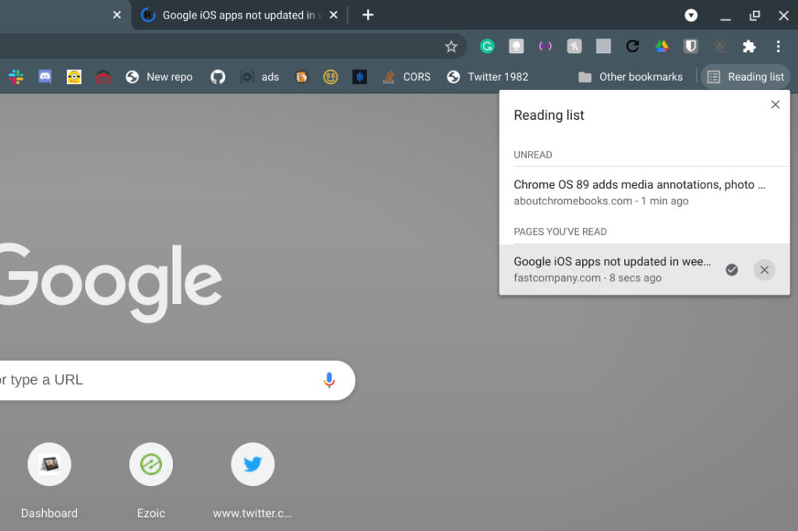

Yesterday I pointed out some [new Chrome OS 89 features available in the current Dev Channel release](https://www.aboutchromebooks.com/news/chrome-os-89-adds-media-annotations-photo-filters-and-a-working-trash-can-for-chromebooks/). There are new annotation functions and native image filters in the Media app, plus a working Trash can in the Files app. Today I noticed that although there's no new functionality, the experimental Reading List has gotten a little coding love.

If you're not familiar with the Reading List, [it first appeared in Chrome OS 87](https://www.aboutchromebooks.com/news/chrome-os-87-stable-channel-arrives-on-chromebooks-what-you-need-to-know/), which all Chromebooks should now have. Essentially, it's a browser tool to save links to web pages so you can read them later.

And in Chrome OS 87, it looks unfinished:

The titles aren't padded or aligned, for example, and the actual viewing area appears to be a set size.

Contrast that with the Reading List view in the current Chrome OS 89 Dev Channel release, where I have the `chrome://flags#read-later` flag enabled.

It's a much cleaner view with proper padding and alignment. The icons to mark a page as read or to delete the page are improved as well, complete with useful tooltips. Now the amount of space taken up by the Reading List changes depending on how many items it needs to display as well. You can also see the Reading List option matches traditional bookmarks: Favicon first and title second.

Although I don't see this functionality yet, the plan is for [saved items in the Reading List to sync across devices through the Chrome browser according to this comment](https://bugs.chromium.org/p/chromium/issues/detail?id=1109316#c21):

> This change is behind the kReadLater flag and allows read later items to sync cross device. This also adds a 'Reading List' option to chrome://settings/syncSetup/advanced on Desktop when the flag is enabled.

Once the Read Later feature is fully rolled out then, your Reading List should "follow" you around from device to device. That's provided you're signed into the Google account where you save web pages, of course. Chrome support is planned for Windows, macOS, Linux, and Android.

One thing I **_don't_** see, but would like to, is any mention of reading saved pages **_offline_**. There are plenty of great services and apps to do this, of course, but to me, it's the last piece of Read Later that would complete the puzzle.
