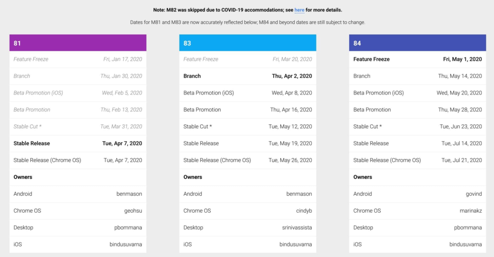
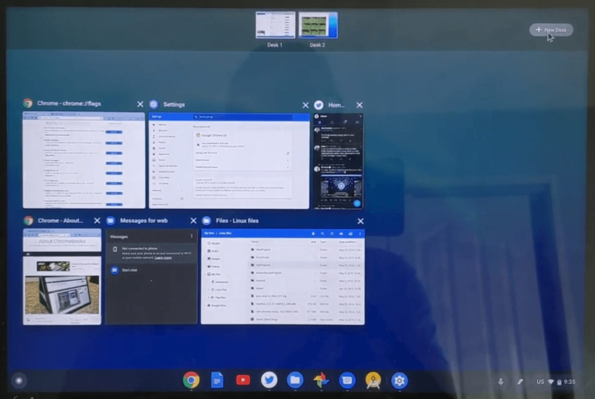

Last week, [Google announced that it would be skipping Chrome OS 82 due to adjusted work schedules](https://www.aboutchromebooks.com/news/chromebooks-skip-chrome-os-82-due-to-covid-19/). At the time, there were no new dates for the Chrome OS 81 and 83 release dates, but the [adjusted milestones now appear on the Chromium Dash schedule](https://chromiumdash.appspot.com/schedule):

Essentially, both Chrome OS 81 been pushed back two weeks while Chrome OS 83 will arrive three weeks after the original Chrome OS 82 target date as a result of the changes.

So instead of a Chrome OS 81 Stable Channel release on March 24, which was the prior milestone date, it is expected to arrive on April 7. Note that a late addition for [Chrome OS 81 is the optional feature to use the Alt-Tab keyboard shortcut on a single workspace if you're using Virtual Desks](https://www.aboutchromebooks.com/news/chrome-os-81-may-get-updated-alttab-improvement-for-virtual-desks-on-chromebooks/).

Virtual Desks in Chrome OS

Following Chrome OS 81, version 83 is expected to land on Chromebooks on May 26; Chrome OS 82 was initially planned for May 5.

Most of this is a renaming exercise and a little extra time for the Chrome Engineering team as features planned for the now-defunct Chrome OS 82 will arrive in Chrome OS 83. And according to Chrome Unboxed, [Chrome OS 83 has already hit the Dev Channel](https://chromeunboxed.com/chrome-os-83-available-developer-channel/), which I'll have to install on one of my devices for testing in the coming weeks.

Keep in mind that Stable Channel release dates after these two versions haven't yet been adjusted, so we'll have to keep an eye on those in the near future.
