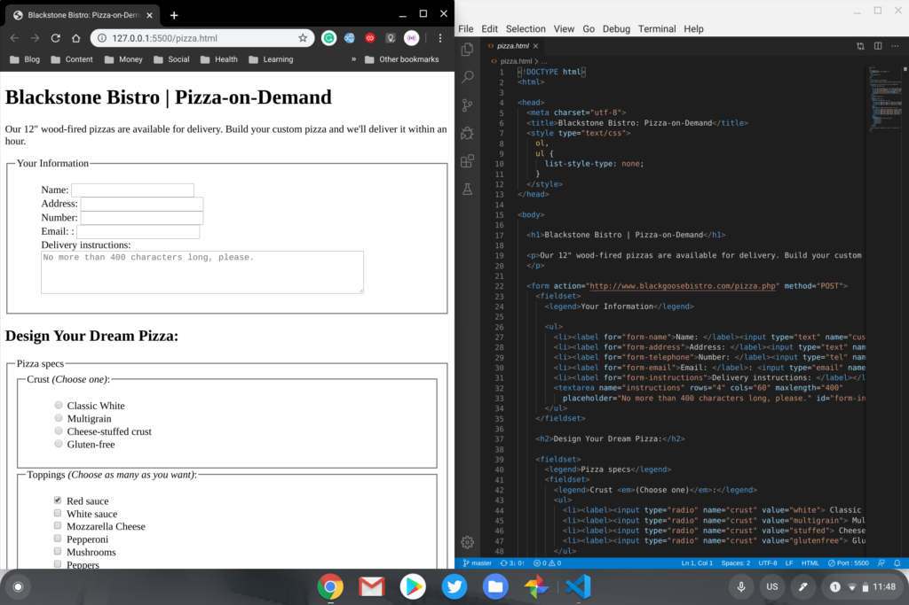

If you have a Chromebook with a fairly meager 16 or 32 GB of storage, [running Linux through Project Crostini](https://www.aboutchromebooks.com/tag/project-crostini/) may not be an option due to limited local storage. [Back in 2018](https://bugs.chromium.org/p/chromium/issues/detail?id=827705), Google realized this and started work on allowing Linux to run from an external drive connected to a Chromebook. After a year of silence, work has recently resumed on this feature; [several code updates moving the effort forward have been committed in the last few months](https://bugs.chromium.org/p/chromium/issues/detail?id=827705).

Assuming this change goes forward, it could let some otherwise Crostini-capable Chromebooks with limited storage space run the virtual machine for Linux on a USB-drive or even an SD memory card. You'll want fast media in either case if you get the chance to try this; running a virtual machine with a Linux container on slower media wouldn't be optimal.

Although I see the potential need for this on Chromebooks with smaller internal drives, it could benefit all Chromebooks users.

For example, you might have 64 or more GB of storage capacity on your device but perhaps you're using the majority of it just for Chrome OS, Android apps and file storage. It would be handy to just whip out a USB drive with your Linux instance, boot up and do whatever you need to in the virtual machine.

Or maybe you have different Linux containers set up for different purposes: one for work and one for general purpose. Either way, having this flexibility could be beneficial.

Of course, given that Google is very focused on keeping Chrome OS secure, implementing Linux and VM support on external drives does bring some challenges. There has been developer chatter on how to best keep the environment secure while also bringing this external drive feature.

The last relevant commentary on the security aspect was to "allow extra disks only on untrusted VMs", but that may not be a bad thing.

Recently, we've seen progress on allowing such VMs and [those have led to the ability to install Windows 10 in a virtual machine on a Chromebook](https://www.aboutchromebooks.com/news/apparently-you-can-run-windows-10-in-a-linux-vm-on-some-chromebooks-now/). In theory, one could run any operating system within such an untrusted VM with the only caveat being that it may not have full access to all hardware and software on your Chromebook.

At the moment, there's no target version of Chrome OS for this feature, so if it does get implemented, it's surely out several months yet.
