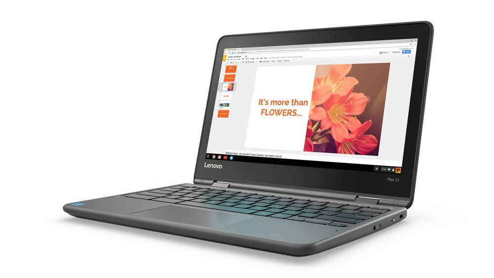

The three-day weekend has kicked off here in the US and folks are flocking to the beaches to enjoy Memorial Day. Before you head out though, you may want to check out a range of holiday deals on Chromebooks. Or maybe you just want to order from the beach - your call!

There are a half-dozen Chromebooks at low advertised or discounted prices on Best Buy's site as well as other specials on Amazon. Here's a sample of the better deals and devices:

[Samsung Chromebook Plus for $379.99](https://www.bestbuy.com/site/samsung-12-3-chromebook-plus-touch-screen-4gb-memory-32gb-emmc-flash-memory-platinum-silver/5620405.p?skuId=5620405). I originally bought this ARM-powered device at full-price last year and found it quite capable. Plus the high resolution touchscreen (and pen-capable) display is excellent. You'll get 4 GB of memory and 32 GB of storage as well. Unless you're a power user, this configuration is solid and $120 off.

[Asus Flip C302CA for $479.99](https://www.bestbuy.com/site/asus-flip-c302ca-12-5-touch-screen-chromebook-intel-core-m3-4gb-memory-32gb-emmc-flash-memory-silver-metal-silver-plastic/6176900.p?skuId=6176900). Another great option if you want to spend a little more for a Core m3 processor. This isn't a major discount from the price -- in fact, [Amazon has it for $10 less](https://amzn.to/2Lwt2nO) (_affiliate link_) but still a good deal on a great Chromebook that you can pick up today.

[Acer Spin 11 2-in-1 for $299.99](https://www.bestbuy.com/site/acer-spin-11-2-in-1-11-6-touch-screen-chromebook-intel-celeron-4gb-memory-32gb-emmc-flash-memory-sparkly-silver/6211731.p?skuId=6211731). This more budget friendly option is $50 off and is more of a basic device powered by an Intel Celeron. Still, if you want the option of a 360-degree screen hinge and can live with an 11.6-inch, 1366 x 768 display, this might work for you. Personally, I'd go for the Samsung Chromebook Plus if I had the extra cash.

Lenovo Flex 11 Chromebook: Another budget friendly option is this [Lenovo model on Amazon](https://amzn.to/2s8g3Ri) (affiliate link) for $244.99, which is a 13 percent discount from the standard price of $279.99. You'll get a touchscreen similar to the Acer Spin 11, along with the same 4 GB of memory and 32 GB of storage but the device runs on a MediaTek  MTK 8173C processor.

Of course, the Google Pixelbook is still the cream of the crop (for now) and the [base Pixelbook is still $100 off at Amazon](https://amzn.to/2sae7rw) (affiliate link). You can nab one for $899.99 and get an [additional 10% off with an Amazon Student Prime account](https://www.amazon.com/gp/promotions/details/popup/A5CUDGR81AC4M), so if have a student (or know of one that might get the deal for you), this is a nice savings for the Core i5 model with 8 GB of RAM and 128 GB of storage. This is the model I bought to use daily and for [testing Project Crostini with Linux apps](https://www.aboutchromebooks.com/tag/project-crostini/).

 

I wouldn't be surprised to see additional sales pop up over this three-day weekend, so be sure to look around online if you're in the market. And if you see any other great Chromebook deals, drop 'em in the comments!
