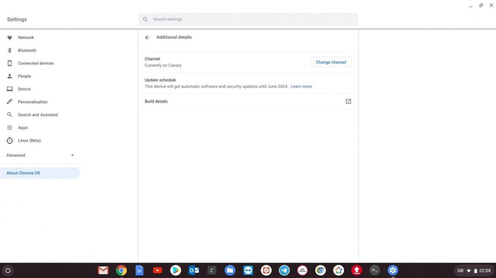

I was thrilled to read this news over at XDA Developers: A new Chrome OS change will [show the exact date for when your Chromebook software updates will end](https://www.xda-developers.com/chrome-os-chromebook-end-of-life-info-settings/). The information will appear in the Settings, when you click or tap the "About Chrome OS" option.

And this news coincides nicely with [Google's recent decision to extend the AUE, or automatic update expiration, for more than 130 Chromebooks and Chromeboxes](https://www.aboutchromebooks.com/news/chrome-os-software-support-dates-extended-for-more-than-130-chromebooks/). In some cases, older devices gained two or more years of software support, which includes both new features as well as security patches.

Credit: XDA Developers

There's still a problem that needs to be addressed, however.

While showing the AUE date on current Chromebooks is a nice plus, it only helps those who already own a Chromebook. The bigger issue, at least to me, is that when purchasing a new Chromebook, most people typically don't know when their device will stop getting software updates until **_after_** they've made the purchase.

What I'd like to see happen is for Google to first request, and then eventually require, Chromebook retailers and resellers to provide the AUE date alongside the specifications of the product, and on the product box as well.

It's a two-step process in my mind because it wouldn't be ideal for Google to suddenly require this change. The company has to give retailers a reasonable transition time to meet this requirement.

I don't place all of the blame on retailers here because they're not the only ones who are letting potential Chromebook buyers down. I have as well because I haven't consistently shared the AUE date when [writing reviews](https://www.aboutchromebooks.com/news/who-is-the-google-pixelbook-go-for-and-not-for/) or news about new devices, nor when pointing out [discounts and sales on them](https://www.aboutchromebooks.com/news/pixel-slate-deal-at-529-99-makes-it-cheaper-than-pixelbook-go/).

So to that end, moving forward, I will always include a mention of the AUE date in those situations here. And if I inadvertently forget to do so, please call me out on it!

That alone won't fix the issue here, but at least I won't be contributing to it any longer. And the real resolution for the problem at large is getting the software update expiration dates front-and-center for consumers _**before**_ the point of purchase.
