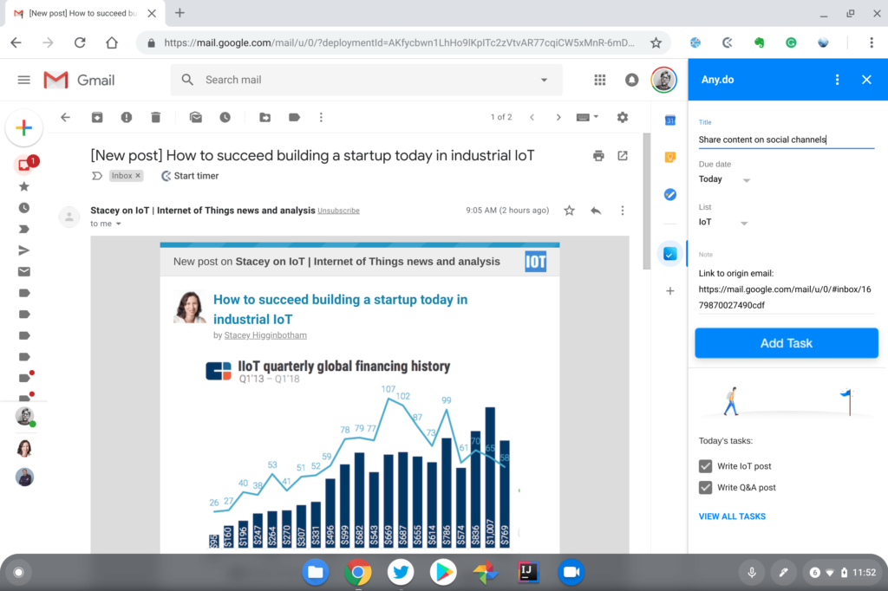
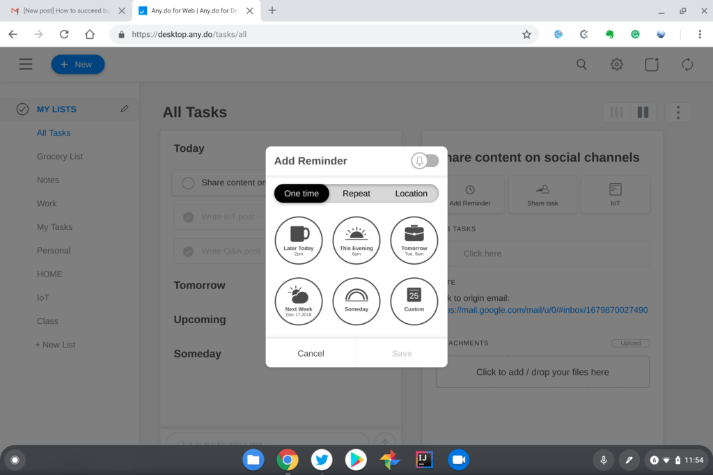
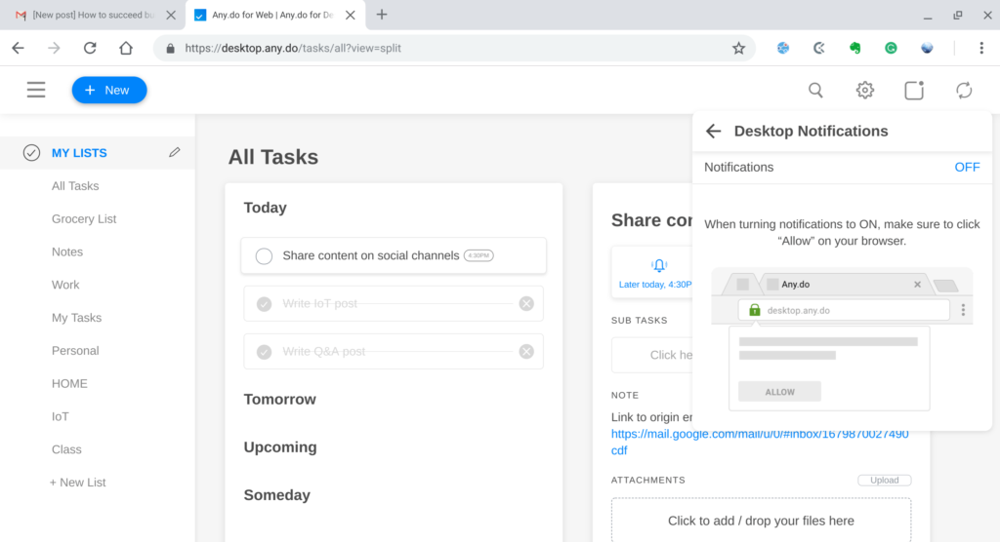

While I tend to focus on Chrome OS devices and the software platform itself, it makes sense to share web-based apps to help maximize the Chromebook experience. I don't know how often I'll do that, but let's start today with this one and see where things go. And I'm starting today because one of my favorite task management apps that now integrates directly with Gmail. Say hello to [Any.do](https://www.any.do/).

Any.do has long been available for just about every platform ranging from iOS to Android, macOS and Windows, and even works with Amazon Alexa; Google Assistant support is in the works. There's also been a web version but as of a few days ago, [Any.do has a G Suite Marketplace plug-in for Gmail](https://gsuite.google.com/marketplace/app/anydo/38800197956). And you don't need to be a G Suite customer to use it; I have it installed on my Pixel Slate with a plain old Gmail account.

Once you install the add-on, you'll see the Any.do logo -- the square blue box with a checkmark -- on the right side of your Chromebook's Gmail interface; it should appear under any Google integrations you might have installed such as your Calendar or Tasks. You can click the logo to get a view of any tasks you've set up in Any.do but the real productivity magic comes from clicking that logo when you have an email message open: Any.do will create a task based on the email.

Here's a perfect example of how I use it. Every day, I share posts from an IoT-focused site on social media channels. Rather than let those emails pile up -- I like a fresh, clean Inbox -- I can open one of those emails and have Any.do create a task for me:

There's a link to the email embedded within the task so if I need to refer back to it, it's right there. And since the app supports multiple task lists, I can even choose which list to use when adding the task. Once I'm done, I can archive the email away, removing it from my now squeaky clean Inbox.

Any.do supports basic reminders in the plug-in but these are customizable as well. Opening the task allows for a more granular due date, including the time. Some are suggested but I use the custom reminder time to plan exactly when I'll be working on the task. I know have a class this afternoon until around 3:20 pm, so I set this task to ping me at 4 pm when I'm back at home.

Of course, like any other web-based app, if you want desktop reminders on your Chromebook, you have to first allow Any.do to show notifications. Hit the Any.do Settings option to enable notifications and you'll get a pop-up approval dialog box in the browser.

There are tons of task managers on the market and Any.do might not fit your workflow, of course. Since it works across so many devices and has a solid web app, however, it has become my go-to app for getting things done.

The app is free but there's [a Premium version for $2.99 a month](https://www.any.do/premium/). That adds more customization options to the look and feel, location-based reminders for mobile devices, a wider range of recurring task options and no limits on file attachment sizes or task sharing; yes, you can use Any.do with teams or groups as well.
