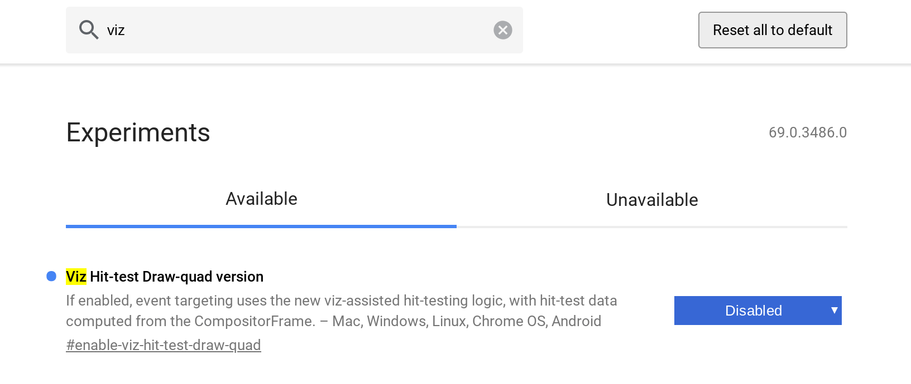

Earlier this month, I noted that [Chromebooks in tablet mode were exhibiting touch issues](https://www.aboutchromebooks.com/news/chrome-os-tablet-touch-issue-screen-rotation-bug/). Since then, I've been monitoring any bugs filed for this problem and it just paid off: [There's a workaround fix](https://bugs.chromium.org/p/chromium/issues/detail?id=860356) I've tested that's simple to apply.

By default, this experimental flag is on: According to the description, it adds some logic for "hit testing", likely to predict likely touch points or to assist in accuracy. Of course, in tablet mode, it's not currently assisting in accuracy as it currently works, at least not when rotating a display.

To disable this flag, type _chrome://flags/#enable-viz-hit-test-draw-quad_ in your browser bar and set the status to "Disabled". You'll need to restart the browser for the change to take effect.

I followed this process on two different Chrome OS devices and can confirm that it solved the problem for the links I clicked. While I can't test every possible web page or scenario, that's a good sign.

For now, this is a workaround fix. The Chromium OS team notes that "This bug is marked as a 68 stable release blocker, and we are coming up on stable in a couple weeks, so we need to get it fixed or reclassify it." That suggests the team is looking into a long-term fix so that the flag will work when set back to its default state; hopefully in time for the Stable Channel of Chrome OS version 68.
