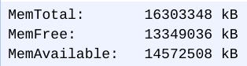
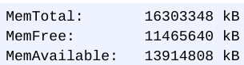
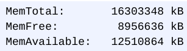
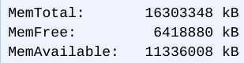
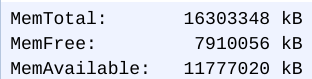
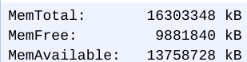
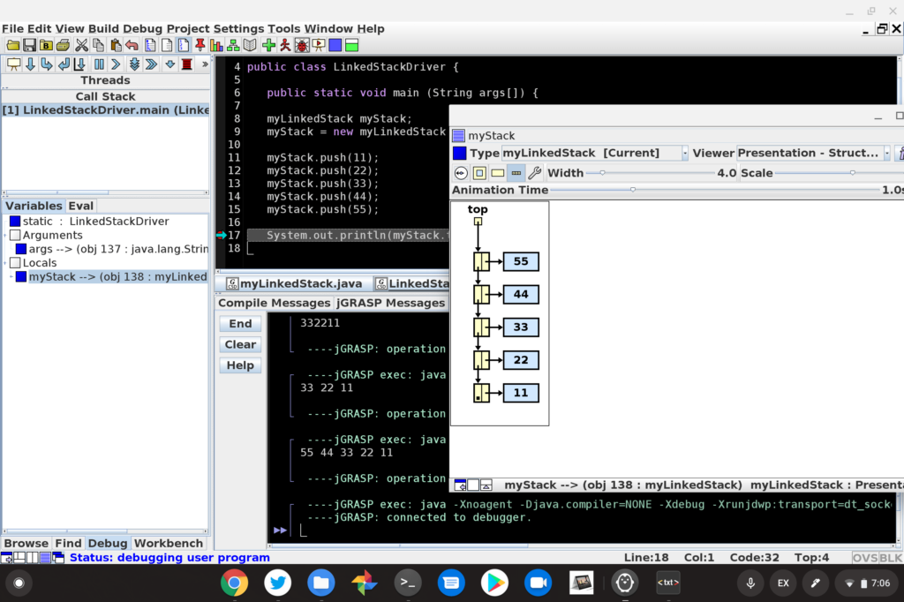

Over the weekend [a headline at Android Police](https://www.androidpolice.com/2020/06/14/chromebooks-desperately-need-more-than-4gb-of-ram-in-2020/) caught my eye: "Chromebooks desperately need more than 4GB of RAM in 2020". That was followed by "8GB RAM or bust". Despite the provocative title, which I think is an extreme position, the article does make sense. But we shouldn't ask for every new Chromebook to come with 8 GB of memory.

Let's start with the data to see if it supports the position of requiring 8 GB of memory on new Chromebooks. There aren't many hard numbers in the article, but it's true that if you use Android apps on a Chromebook, you'll be using memory even when you aren't running those apps.

I verified that by doing several memory tests on my Chromebook: When I removed the Google Play Store option, less memory was used upon the next bootup.

Free memory after removing Google Play Store and rebooting

Free memory after enabling Google Play Store and rebooting

The reason is because Android apps, like Linux apps, run in a container within Chrome OS. And if you have the Google Play Store enabled on your Chromebook, that container runs upon device startup. So even without any Android apps running, some of your memory is gobbled up by the Android container. This is for a better user experience: When you open an Android app on a Chromebook, you want it to open right away; you don't want to wait for the Android container to start up.

However, the Linux container impacts memory differently, for a few reasons.

First, if you don't have Linux enabled on your Chromebook, the container files aren't even present. So the container can't even run or use memory. Second, even if you do have the Linux option turned on, the container _**doesn't**_ run at startup. That container won't fire up and use memory until you either open the Terminal app or some other Linux app.

The first time you do that, you'll have to wait a few seconds before Linux or a Linux app fires up. That's the time it takes to start the container and virtual machine to run Linux. And that's when your memory gets used. Again, I ran multiple tests and watched memory usage after each step in the process to verify this. One of those tests was to shut down the Linux container (it's an option if you right-click on the Terminal app), which reclaimed memory as I expected.

Free memory after opening Terminal, which also starts the Linux container

Free memory after opening VS Code in Linux

Free memory after closing VS Code in Linux

Free memory after closing Terminal and shutting down the Linux container

So long story short: Enabling the Google Play Store will use up some Chromebook memory on every bootup, while enabling Linux in Chrome OS will not. Running Android or Linux apps after bootup will of course use more memory. You can recover memory by closing down the Linux container but you can't do the same with the Google Play Store, unless you disable it entirely.

With that information in mind, what would be the repercussions of requiring 8 GB of memory at a minimum on Chromebooks, and does every user need more than 4 GB for their Chrome OS device?

I'll answer the second question first because it's easy: The answer is no.

There's a segment of the market that spends $200 to $300 on a basic browsing machine. Having 4 GB of memory could cause some performance issues over time as more tabs are opened, but people can still do what they want. Schools in particular would fit this use case, as would people who may have a more powerful computer for their primary usage.

Adding Android apps to the mix in this case isn't likely the primary reason for buying such entry-level devices. It's really an occasional bonus.

And you can still [run a few Android apps with a 4 GB Chromebook](https://www.aboutchromebooks.com/news/lenovo-ideapad-duet-chromebook-review-2020/).

Is the experience ideal? No, but it works and the user didn't have to pay double or triple to get a higher end machine with better processor, likely a better screen, and more memory. Put another way, these devices have been the sweet spot for everyday mainstream consumers that want a simple and safe browsing experience.

I'm not in that category, which is evident by my primary Chromebook: [An Acer Chromebook Spin 13 with 16 GB of RAM](https://www.aboutchromebooks.com/news/acer-chromebook-spin-13-with-16-gb-ram-should-you-buy-one/). But I use Linux on a daily basis for [coding apps](https://www.aboutchromebooks.com/news/how-to-code-on-a-chromebook-crostini-pixel-slate/) or [taking Computer Science classes](https://www.aboutchromebooks.com/news/can-you-learn-to-code-in-a-college-computer-science-program-with-a-chromebook/) and wanted more headroom for the often "heavy" integrated development environments and tools I need. I'm sure I'm in a very small group of folks who want, need or bought a Chromebook with 16 GB of memory.

You really need a U-Series for coding on a Chromebook

Let's tackle the first part of my earlier question: What would happen if every Chromebook came with 8 GB of memory. Well, the first thing is improved performance. That's good! And the second thing is that the previously mentioned sweet spot of entry level devices would cost more. Sure, RAM is cheap but I'd expect devices to all jump up by at least $50 for doubling of the RAM.

That could negatively impact the appeal of an entry level Chromebook for many people, and those are the ones that I believe make up most sales in the Chromebook market. If I'm correct in that opinion, that could stifle device sales growth at a time where Chromebooks are still (unfairly) seen as "just a browser".

Multiple Chrome tabs, a PWA, Google Play Music Android app and Linux humming along.

However, I'm not against more memory in Chromebooks. In fact, when asked to choose between devices with respect to better processors OR more memory, I universally go with the latter. I think you get more bang for your buck buying a Core i3 device with 8 GB of memory compared to a Core i5 with 4 GB, for example.

So I'd say we should temper down the request for an 8 GB memory minimum. Instead, I'd prefer to see more customization options available at all price ranges to choose a memory upgrade at the point of purchase. But that's just me: I'd love to hear your thoughts.
