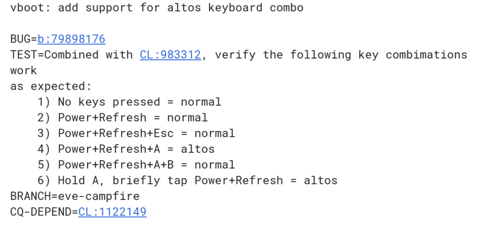

There's plenty of evidence that Google will allow some Chromebooks to [dual-boot into Microsoft Windows 10](https://www.aboutchromebooks.com/news/run-windows-on-a-chromebook-great-idea/); that effort is called Campfire. Although users will have a boot screen to choose their operating system, it appears there may be a keyboard combination upon startup that fires Windows up without the boot screen option [based on this code commit](https://chromium-review.googlesource.com/c/chromiumos/platform/depthcharge/+/972763).

As shown by the commit from September 4, holding the Chromebook's power button as well as both the Refresh and A keys will boot directly into an "AltOS", which is supports Windows 10. This is currently only applicable to a special, or forked, build for Eve, which is the current Pixelbook.

I'd anticipate it to also apply to the [Pixelbook 2, which looks to be a similar device but with smaller bezels](https://www.aboutchromebooks.com/news/pixelbook-2-leak-smaller-bezels-madebygoogle-chromebook/) and powered by newer 8th-generation Intel Core processors. I'm still thinking that the Pixelbook 2 is actually the "Eve-Campfire" device, not [Atlas](https://www.aboutchromebooks.com/news/more-evidence-suggests-atlas-is-a-4k-detachable-chromebook-tablet/) or [Nocturne](https://www.aboutchromebooks.com/news/nocturne-to-be-a-chrome-os-detachable-with-high-res-display-and-fingerprint-reader/), both of which are detachable Chromebooks -- meaning there will be more than one #MadeByGoogle Chromebook soon. The odds are leaning towards Nocturne making its debut next month, but [we'll see on October 9](https://www.aboutchromebooks.com/news/pixelbook-2-atlas-nocturne-madebygoogle-event-october-9/).

_Updated wording on 9/12/2018 to reflect that AltOS supports Windows 10, but may not be limited it that OS._
