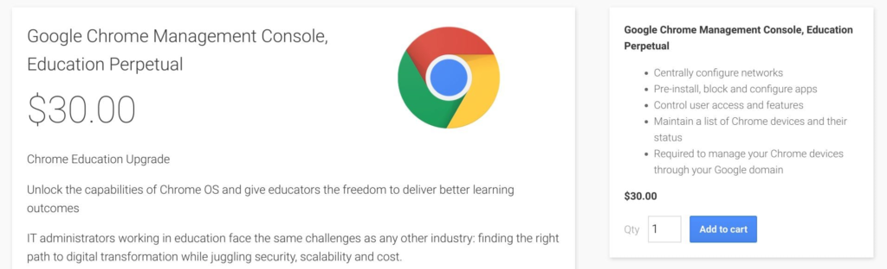

I tuned in to the [Alphabet investor call earlier this week](https://www.youtube.com/watch?v=-GyJVNcL0zg) and most of the product mentioned were the big earners: advertising in general, YouTube with its brand properties and Google Cloud. There wasn't a single mention of or question about Chromebooks.

I found that a _little_ surprising even though Chromebook sales themselves don't add to Google's earnings save for its own Made By Google devices. It is worth noting that Google's hardware division earned less than in the prior year; I suspect that's due to lackluster Pixel Slate sales but no specifics were given.

And yet, Google announced a few weeks ago that [40 million Chromebooks are used in by students and educators in classrooms](https://blog.google/outreach-initiatives/education/2020-chromebooks/); growth of [33 percent in a single year](https://9to5google.com/2019/01/22/30m-chromebook-education-users/). That's the same announcement that added more life to many Chromebooks by [extending the Automatic Update Expiration date on all new Chromebooks going forward](https://www.aboutchromebooks.com/news/google-announces-8-years-of-chrome-os-software-updates-aue-for-new-chromebooks/).

So if Google doesn't make money on the sales of Chrome OS hardware made by its partners, how do all of these Chromebooks for EDU contribute to Google's bottom line?

The answer is in add-on services. G Suite for Education is free but a Google Chrome Management Console license isn't. Until recently, that would cost a school $30 per managed device for the lifetime of that device; it's now $38 .

And I'd bet that the vast majority of classroom Chromebooks are managed: This allows the school's IT department to lockdown the devices, restrict access to certain websites or Android apps and more. In this day and age, a school wouldn't simply buy Chromebooks without being able to manage them any more than a small business or corporation would.

For sake of argument, I'm going to estimate that 90 percent of those 40 million Chromebooks are managed. That gives us 36 million managed devices. And those are covered under the $30 license cost since the price only went up after Google announced the 40 million Chromebook figure.

Of course, that $30 is spread out over the life of a Chromebook. I don't think most Chromebooks in schools last more than four years before getting retired or replaced but I'll be pessimistic and use a five-year life span. So that's $6 per year for each of the 36 million managed Chromebooks, bringing in revenue of $206 million annually.

So Chromebooks for education aren't yet even _close_ to a billion dollar run rate, which is really when Google starts breaking out product information to investors. However, it's a sizable sum for a very specific market. And this is just for the EDU market; Google charges businesses for Chrome device management in a similar fashion.

If Google continues to sell Chromebooks into the classroom at its current growth rate, this product could be adding close to a billion dollars a year to Google by 2030. And who would have thought that just [a decade ago when the first Chromebooks hit the market](https://www.aboutchromebooks.com/news/chrome-os-is-10-years-old-heres-the-first-demo-from-2009/)?
