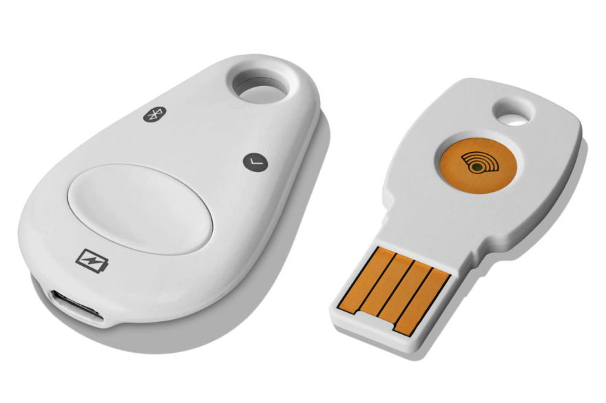

A few years back, I bought a [Google Titan security key to bring the added security of two-factor authentication (2FA) to my Chromebook](https://www.aboutchromebooks.com/news/got-a-chromebook-consider-securing-it-with-a-google-titan-key/). I got my money's worth out of it but I won't need it much longer. This week, Google announced that Chromebooks are gaining the ability to use your device PIN or fingerprint sensor for 2FA on supported web sites.

Here's how it works, [according to Google](https://blog.google/products/chromebooks/sign-sites-faster-and-personalize-your-lock-screen/):

> "Now you can securely sign in to websites with the PIN or fingerprint you’ve set up to unlock your Chromebook with our new Web Authentication (WebAuthn) feature. Websites that support WebAuthn will let you use your Chromebook PIN or fingerprint ID—if your Chromebook has a fingerprint reader—instead of the password you’ve set for the website. And if you use 2-Step Verification to sign-in, your Chromebook PIN or fingerprint ID can be used as the second factor, so you no longer need to pull out your security key or phone to authenticate."

For now, only a few sites and services support the new WebAuthn feature on a Chromebook. Dropbox, GitHub, and Okta are specifically mentioned, although I'd hope that Google's own services support it too at launch.

This is a great step forward for additional security when using a Chromebook. Having a USB or Bluetooth key, which are older methods, certainly works, but they're also easy to lose.

And while you can often use an authentication app (or the Google app) from your phone, that can be a small hassle too. What if your phone isn't handy? Frankly, using the same device for a 2FA code or fingerprint scan is much simpler and faster.

Google says the new feature will be rolling out with Chrome OS 88, which I anticipate will arrive on Chromebooks soon.

My advice: Use 2FA for every site or app that supports it. If someone were to get any of your account credentials, they **_still_** couldn't access your accounts without that second factor of authentication. Google just made it easier for you to be protected and harder for hackers to compromise your online servers. Why not take advantage of it?
