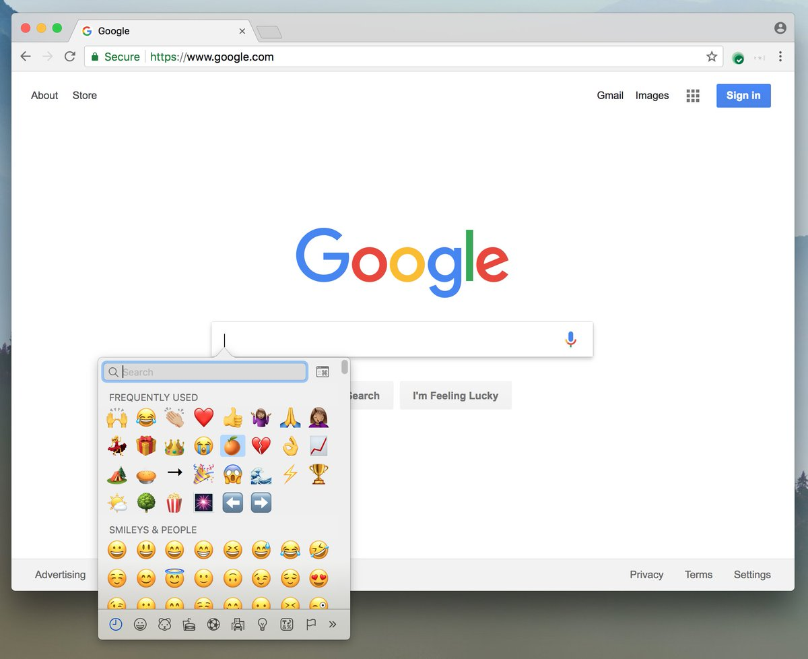
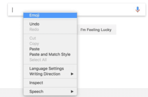

It should get easier to [add emoji to any text field on a Chromebook](https://twitter.com/__apf__/status/981955051194220545) or any other computing device that uses the Chrome browser. Google engineer and manager on the Chrome team, Adrianne Porter Felt tweeted the news and showed off the new emoji menu option in a screen shot on Twitter, which was [reported by 9to5Google](https://9to5google.com/2018/04/05/google-chrome-emoji-shortcut-mac-windows/) on Thursday.

In the screen shot, which was taken of Chrome for Mac, you can see a pretty standard emoji picker that appears when clicking in a text field. To make the option visible, Felt right clicked on the text field and an emoji option appeared atop the pop up menu options.

Don't go rushing to try this on your Chromebook or in the Chrome browser just yet: The feature is experimental in the Canary Channel, which where Google tests new functions on a regular basis. Eventually, if all goes well, the new emoji option will make its way through the Dev, Beta and Stable Channels.

If you want to change [Channels on your Chromebook, it's pretty easy](https://aboutchromebooks.com/qa/whats-the-difference-between-developer-mode-and-the-dev-channel-on-a-chromebook/) but I'd wait at least until this feature appears in the Dev Channel because Canary software can change multiple times a day. Once this feature appears in the Channel you're using, you can enable it by typing _chrome://flags_ in your browser and search for the _enable-emoji-context-menu_ option to activate it.
