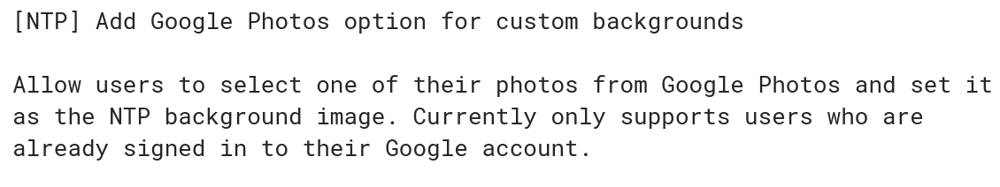

Back in May, [Chrome Story saw some upcoming customization options for the new tab page (NTP) in Chrome OS](https://www.chromestory.com/2018/05/chrome-ntp-custom-background-image/). Today I found a new addition added for the NTP that will allow you to [choose one of your Google Photo images as the background](https://chromium-review.googlesource.com/c/chromium/src/+/1130100) on a Chromebook, Chromebox or Chrome tablet.

The change description is pretty explanatory and of course, you'll need to be signed in to your Google account since that's the linkage to your Google Photos. Then again, you're likely signed in with Google anyway to use Chrome OS.

There's currently a flag in the Dev Channel, found at at [chrome://settings/#ntp-backgrounds](chrome://settings/#ntp-backgrounds), for configuring the NTP look, but there's not yet an option to actually use it. So this code isn't fully implemented just yet.

And I'm not sure that many Google Photos (at least in my account, although the pic of my dog Norm as a toll-taker still makes me laugh!) will make good candidates for a background every time you open a new tab: You'll want to clearly see the Google Search bar and possibly your frequently visited sites. Still, there might be some good options in your Google Photos collection and once this change is implemented, you'll be able to see them on every new tab if you want.
