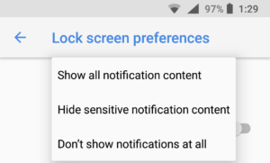

Are you missing incoming notifications when your Chromebook is locked? You won't have to once a new lock screen notification feature arrives in Chrome OS. It's already available on the Canary Channel [thanks to this code change that was committed earlier this morning](https://chromium-review.googlesource.com/c/chromium/src/+/1161715):

> Initial implementation of Lock Screen Notification. This CL introduces the feature to defer events from notifications until the device unlocks, add adds the UI to encourage user to unlock the clicked notification to perform their events.

[Dinsan over at Chrome Story spotted the code change](https://www.chromestory.com/2018/08/chromebook-lock-screen-notifications/) and found that enabling the chrome://flags/#enable-lock-screen-notification flag -- which has actually been available but dormant for some time -- works for him. I'm on the Dev Channel; enabling and testing the flag there isn't working for me just yet. I expect we'll see it active in Dev within the next update or two.

Dinsan says that the notification counter in the System Tray indicates if you have notifications and, if so, how many. To see them you need to click the number to expand the tray and view the actual information.

Since this is just the initial implementation as noted in the change log, the final lock screen notification method could look or behave differently. And my hope is that even if you enable it, there will be a way to customize the notification types, similar to the Android implementation.

On my phone, I can choose between "Show all notification content" and "Don't show notifications at all" on the Lock Screen, which essentially would be equivalent to enabling or disabling them on my Chromebook. But there's also a "Hide sensitive notification content" option that would be nice to have in Chrome OS as well. With this option, you'll see notifications that you received and email or [a text message](https://www.aboutchromebooks.com/news/android-messages-for-web-works-great-on-a-chromebook/), for example, but the contents would be hidden until the device is unlocked.
