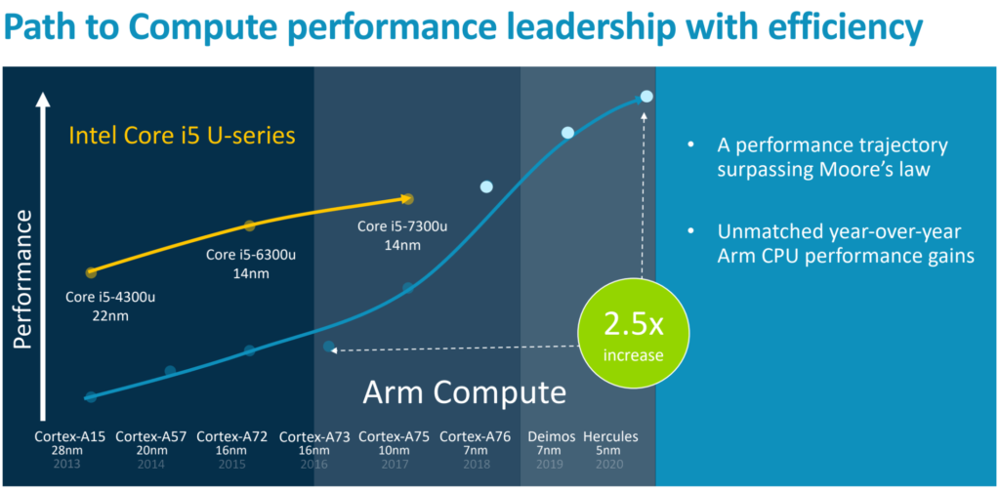

This week, [MediaTek announced a pair of processors specifically for Chromebooks: The MT8192 and MT8195](https://www.mediatek.com/news-events/press-releases/mediatek-announces-new-mt8192-and-mt8195-chipsets-designed-for-next-generation-of-chromebooks). Devices using these chipsets are expected in the second quarter of 2021. I've been researching the specifications of the MT8192 and MT8195, finding several attributes that suggest better performance than the [Qualcomm Snapdragon 7c that powers the Acer Chromebook Spin 513](https://www.aboutchromebooks.com/news/hello-acer-chromebook-spin-513-the-first-with-a-qualcomm-snapdragon-7c/).

This shouldn't be _too_ surprising if you've been following mobile SOC (system on a chip) news for the past year or two. The [Snapdragon 7c (and higher performing 8c) chipset was announced nearly a year ago](https://www.qualcomm.com/news/releases/2019/12/05/qualcomm-snapdragon-powered-always-always-connected-pc-portfolio-expansion). It's based on an 8nm process and has 8 computing cores: Two Cortex-A76 cores with up to a 2.4 GHz clock speed and 6 low-power Cortex-A55 chip cores.

## More efficient process and a newer architecture

**Both** of the newer MediaTek chips for Chromebooks either meet or exceed potential performance based on more recent ARM architecture designs and/or a more power-efficient build process that can pack more transistors into the same space.

Let's start a 7c comparison with the M8195, which is the higher-end of the two new MediaTek chipsets.

It's built on TSMCs 6nm process, so there are immediate power efficiency gains available simply based on the transistor density. Like the Snapdragon 7c, it has 8 CPU cores. Unlike the 7c are the configuration and ARM architecture. The M8912 has four high-power Cortex-A78 cores and four of the same Cortex-A55 cores as the 7c.

Just to add more context about those four Cortex-A78 cores, consider the CPU roadmap ARM shared back in 2018:

You can see that Cortex-A76 chips such as those used in the Snapdragon 7c were a nice expected upgrade over chips using older architectures. But the Cortex-A78's in MediaTek's new SOCs will bring another leap in performance.

[When the ARM roadmap came out in 2018](https://www.aboutchromebooks.com/news/intel-vs-arm-chromebooks/), I noted the expected performance leap, saying I’d anticipate that more Chrome OS hardware partners consider using Arm-based processors in their Chromebooks over the next 12 to 24 months. And when this architecture was announced earlier this year, [The Verge said to expect 2021 flagship smartphones built around it](https://www.theverge.com/circuitbreaker/2020/5/26/21267893/arm-cortex-a78-mali-g78-cpu-gpu-designs-smartphones-2021-samsung-qualcomm-apple).

Even the lower-end MT8192 is no slouch by comparison to the Snapdragon 7c. It uses the same Cortex-A76 cores but has four instead of two. Of course, that means having two fewer of the more power-efficient Cortex-A55 cores.

## So what does all this mean for ARM-based Chromebooks?

Acer Chromebook Spin 513 running Chrome and Visual Code in Linux

We know that in a few months the [Acer Chromebook Spin 513 with the Snapdragon 7c compute platform will be available for purchase, starting at $399](https://www.aboutchromebooks.com/news/hello-acer-chromebook-spin-513-the-first-with-a-qualcomm-snapdragon-7c/). More storage and/or integrated LTE will cost you more. And it will likely be on sale at least a few months before any Chromebooks with the new MediaTek processors arrive.

When they do, however, you'll have a choice to make if you want a new ARM-based Chromebook. Much of that will depend on the prices between Qualcomm- and MediaTek-powered devices, and we don't know that yet. We _do_ know if you want integrated LTE, you'll likely opt for the Acer: Qualcomm's integrated modems are among the best in the business.

But if you want more performance or features such as the ability to drive three displays and have support for Dolby Vision and 7.1 surround sound (found in the MT8195) or a full-HD display at 120Hz, you might want to take a new MediaTek-powered Chromebook for a spin. Think of at least a step-generation improvement in performance as compared to the [already capable Lenovo Chromebook Duet, which runs on a MediaTek MT8183](https://www.aboutchromebooks.com/news/lenovo-ideapad-duet-chromebook-review-2020/).

Either way, we're finally starting to see real progress and potential in ARM-based Chromebooks. Up to now if you wanted one with mid- to high-end performance, Intel was your likely your first and only choice. In 2021, you'll have another chip contender worth considering.
