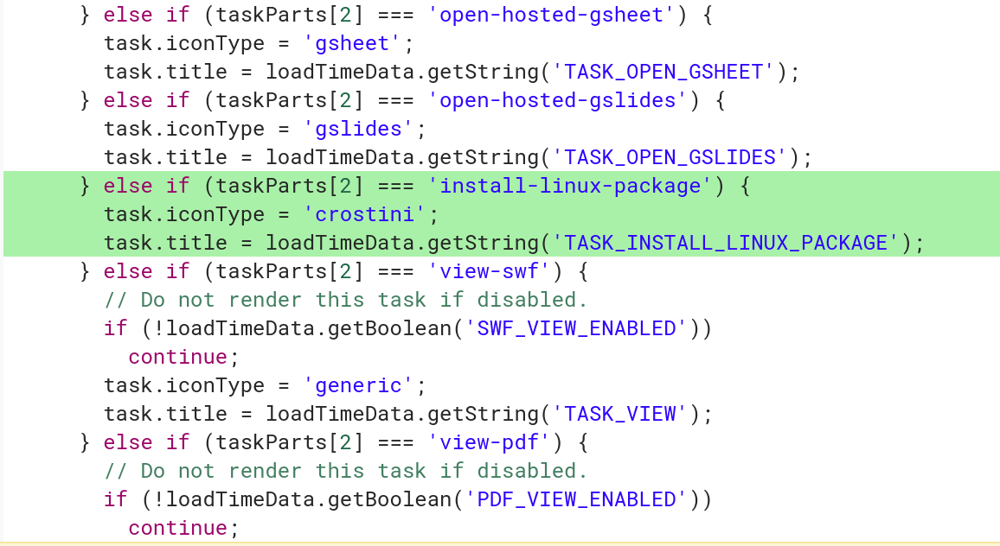

Last month, [XDA-Developers reported that Google's Project Crostini would support a simple installation of Linux apps](https://www.xda-developers.com/chromebooks-linux-app-install-debian-packages/). Currently, all Linux packages are installed directly in the Linux container through the command line interface, which can be clunky for those new to Linux using [Project Crostini](https://aboutchromebooks.com/tag/project-crostini). Google is simplifying this process directly through the native Files app in Chrome OS.

[Recent code changes](https://chromium-review.googlesource.com/c/chromium/src/+/1126812) show that Google is adding a file handler for Debian packages so that if a user downloads an app package within Chrome OS -- where they would appear in the Files app with a .deb extension -- the user can then choose to have the package installed in the Linux container.

As I understand it, right-clicking on a .deb package in the Files app will show a "Install with Linux (Beta)" option. Additionally, all information for the application install will appear as system notifications in Chrome OS.

The functionality is welcome, but a bit basic. In the change description, developers say that they plan to retrieve and show information about the package, such as the name, version and description of package, similar to how a modern package manager in Linux works today. And when this feature arrives, you won't be able multi-select several .deb packages for installation; the first implementation will only support a single install at a time.

Even so, this is another step towards a pure user experience integration between Chrome OS and native Linux apps, without adding the confusion of having a full graphical Linux desktop environment: That would likely bring more confusion to the Chrome OS experience, which Google tries to keep as simple as possible.
