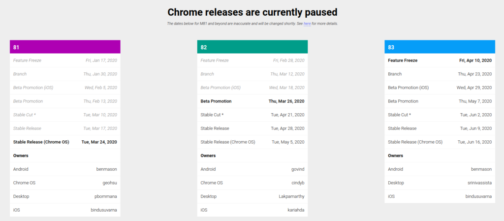

During a global pandemic, getting the next Chrome OS release on time isn't the highest priority of course. And on Wednesday, [Google officially announced that it was pausing all Chrome and Chrome OS updates](https://chromereleases.googleblog.com/2020/03/upcoming-chrome-and-chrome-os-releases.html) due to "adjusted work schedules".

The company says that it would prioritize any security issues and push them out in updates to the current Stable Channel version of Chrome OS, which is 80.

So what happens after Chrome OS 80? Well, Chrome OS 81 was slated for release to Chromebooks later this month. Based on the pause in updates, that's unlikely to happen on time.

Chrome Unboxed found some additional details indicating that [Google will completely bypass Chrome OS 82](https://chromeunboxed.com/chrome-os-version-82-abandoned-delays-release/), meaning at some point, Chrome OS 83 will follow. There will not be a Chrome OS 82.

The official Chromium Dash schedule doesn't yet show new dates for releases, although it does indicate the pause in Chrome releases.

Based on [comments from the Chrome Engineering team in a Google Group](https://groups.google.com/a/chromium.org/forum/#!topic/chromium-dev/Vn7uzglqLz0), this is how developers will manage code at the present time:

- We will **abandon current M82 branches**, remove infra support, and stop testing/merges to the branches
- We will not push any new M82 releases to Dev, and we will stop stabilization for Beta
- We will **move Dev channel to M83 asap**
- We will keep Beta channel on M81 until M83 is ready to be promoted 

The plan is to release Chrome OS 81 to stable, although the date may shift. At that point, new milestone dates for Chrome OS 83 will be published with that version potentially being moved up. That could the typical six-week cycle between releases won't happen; instead, with Chome OS 82 not arriving at all, Chrome OS 83 could follow sooner than initially planned, which is currently June.

Clearly, this is a fluid situation, just like everything else right now. The team expects to provide further timeline guidance this week in keeping with these two objectives [based on a recently updated Google Doc](https://docs.google.com/document/d/1dppYMaUK0A0PxzRZC647WsCAAK-8ccuH6l7rMAhdwL8/edit):

> 1) Keep the trunk stable and reliable, so that once we restart releases we don’t end up with many bugs that delay trunk going to stable.
> 
> 2) Ensure that we can merge fixes to M80 or M81 when needed.

Any new features in Chrome OS 81, such as [easier sideloading of apps built in Android Studio](https://www.aboutchromebooks.com/news/chrome-os-81-to-bridge-the-android-container-and-android-studio-for-easier-sideloads-on-chromebooks/), the [Debian Buster upgrade for Linux](https://www.aboutchromebooks.com/news/chrome-os-81-dev-channel-adds-buster-upgrade-linux-disk-resizing-custom-username-chromebook/), [Linux disk resizing](https://www.aboutchromebooks.com/news/linux-disk-resizing-on-chromebooks-pushed-back-to-chrome-os-81/) and the [improved Bluetooth pairing experience](https://www.aboutchromebooks.com/news/chrome-os-81-to-improve-pairing-experience-for-your-bluetooth-keyboard-and-mouse/) should still arrive when that version is released. However, I don't know if it's still on track for this month; we should hear more details about that soon.

Any features planned for Chrome OS 82 then would be merged into the following version. Essentially, there may be a wait for the latest Chrome OS improvements but it shouldn't be too long; they'll just arrive in a different version number.

While it's easy to suggest that Google and the Chrome OS schedule shouldn't be impacted since everyone on the Chrome dev team can likely work remotely, I completely understand this pivot. People are dealing with family pressures, shelter-in-place regulations, shortages of supplies and investment accounts tanking.

That's partly why I haven't written [any news posts since sharing my thoughts on the situation last Sunday](https://www.aboutchromebooks.com/news/this-post-has-nothing-to-do-with-chromebooks/). There are simply more important things for all of us to be focused on.
