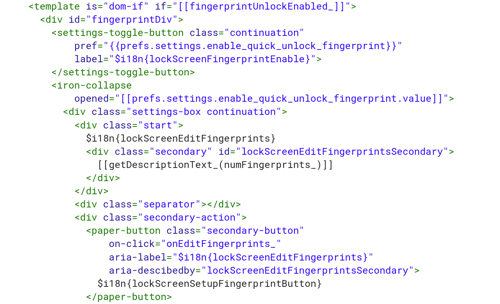
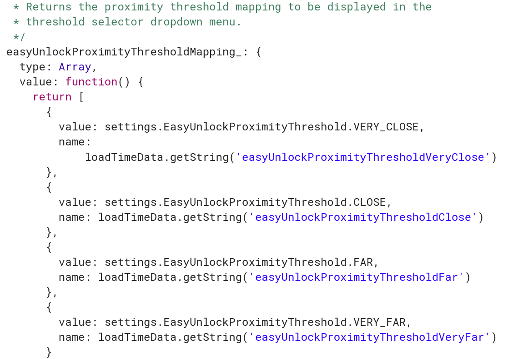

Last month, we saw [details of a Chrome OS feature called "Better Together."](https://www.aboutchromebooks.com/news/better-together-bringing-instant-tethering-voice-calls-and-easy-unlock-to-chromebooks/) That may be the front-facing name for it but behind the scenes, it's called MultiDevice. And there are already MultiDevice flags and settings that appear on the Chrome OS Dev Channel.

One of the functions being folded into MultiDevice setup is Easy Unlock, which can unlock your Chromebook with a nearby Android phone, [just as it can today](https://support.google.com/chromebook/answer/6070209). It will also [support fingerprints based on the code I found today](https://chromium-review.googlesource.com/c/chromium/src/+/1142387/6/chrome/browser/resources/settings/people_page/lock_screen.html).

This isn't terribly surprising as previous information shows [fingerprint sensor support for Chromebooks](https://www.aboutchromebooks.com/news/nocturne-to-be-a-chrome-os-detachable-with-high-res-display-and-fingerprint-reader/) on at least one device board.

What makes this more interesting though is that the Easy Unlock feature (as part of the MultiDevice setup) will have four different proximity levels. Meaning: You should be able to set up the ability to unlock your Chromebook based on your own personal preferences regarding how close or how far you are from the device, [based on this code snippet](https://chromium-review.googlesource.com/c/chromium/src/+/1142387/6/chrome/browser/resources/settings/people_page/lock_screen.js#165):

That suggests to me that we'll see a dropdown or other input setting for proximity, meaning, how near or far from your Chromebook you can be while still allowing the device to be unlocked via a trusted Android phone and Bluetooth. The options are: Very Close, Close, Far, and Very Far.

It's possible even that with four different proximity thresholds, Google could rely on a longer ranged signal, such as a peer-to-peer Wi-Fi connection between a Chromebook and an Android phone. That's simply a guess on my part though: I'm still trying to understand why four different proximity levels are needed and what would be ranges of trigger points.

**Update**: Thanks to Ken, who left a comment below, the four proximity levels are part of the current, standalone Smart Lock (beta) settings for Bluetooth distance. I use 2FA to secure my devices, so I don't use Smart Lock and didn't know the settings were available in beta. Thanks Ken!
