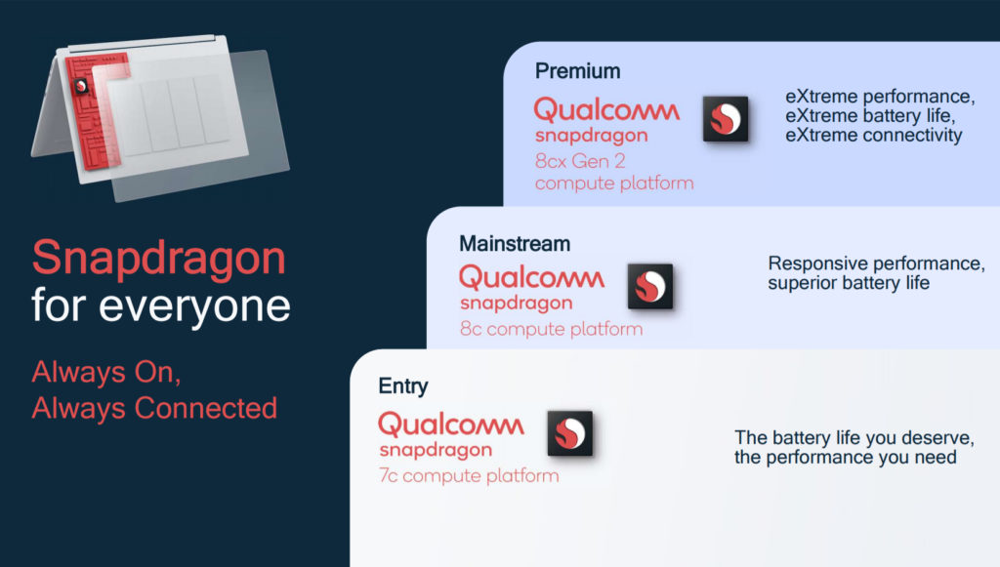

[Qualcomm today announced its second-generation Snapdragon 7c chipset](https://www.qualcomm.com/company/events/snapdragon-compute) although this is just a minor refresh. There's little physical difference in the updated silicon. Still, you can expect Chromebooks with Qualcomm's Snapdragon 7c Gen 2 to eke out a smidgen more performance over devices using the prior chipset.

At the moment, there aren't many Chromebooks using the Snapdragon 7c. The [recently released Acer Chromebook Spin 513](https://www.aboutchromebooks.com/news/acer-chromebook-spin-513-with-snapdragon-7c-available-in-the-uk-for-399-99/) was the first and remains the only current model with Qualcomm inside. That may change over the rest of the year as Google has said to expect 50 new Chromebooks in 2021. Even with more than four-dozen new models expected, I wouldn't expect many to go with a Snapdragon.

Let's go over the updated, second generation Qualcomm Snapdragon 7c and then consider the impacts on future Chromebooks:

> Overall, Snapdragon 7c Gen 2 boasts up to 10 percent higher system performance compared to competitive platforms. It also offers up to 19+ hours of continuous use on a single charge, with up to 2x the battery life of typical entry-level laptops.

That sounds good, but let's dig past the marketing speak for a second and consider this [high-level comparison of the first- and second-generation Snapdragon 7c chipsets](https://www.qualcomm.com/products/snapdragon-7c-gen-2-compute-platform).

I see all of two minor differences in the Gen 2 model. First is the removal of a WiFi feature called "Target Wake Time". And second is a bump in the CPU clock cycle from 2.4 GHz to 2.5 GHz. That's it. There's no change to the LTE modem capabilities or anything else that I can see on the scant chart.

Going a little deeper and looking at the CPU and GPU cores, the story is the same. This updated Snapdragon 7c still uses two Kryo 468 CPU cores based on Cortex-A76 architecture and six Kyro CPU cores on the more power-efficient Cortex-A55 platform. So when Qualcomm says "up to 10 percent higher system performance compared to competitive platforms", which really means Intel Celeron and Pentium chips, that's not much.

In fact, based on the [Acer Chromebook Spin 513 reviews](https://www.aboutchromebooks.com/news/acer-chromebook-spin-513-review-roundup-a-relatively-solid-entry-level-laptop/), the performance was middling at best, although probably in line for a $349 to $399 device.

Don't get me wrong: Any silicon improvements for Chromebooks, regardless of who builds or designs the chips, are always welcome. But I've read dozens of online comments suggesting that the _**next**_ Snapdragon 7c would be the one to really give Chromebooks a performance boost. It doesn't appear that's going to be the case.

And to be clear, it's not just me that considers the Snapdragon 7c to be an entry-level device chip, regardless of platform. The company's own marketing slide clearly shows this positioning.

What I'd really like to see is Google and its hardware partners develop a Chromebook with either the Snapdragon 8c or, even better, the 8cx Gen 2 Compute Platform.

I realize that testing the market with entry-level Snapdragon chips in Chromebooks makes sense and you have to start somewhere. But, you run the risk of people associating the entire chip platform with that entry-level experience. Put another way: You only have one chance to make a first impression. And if you don't believe that, just look at [what happened to the Pixel Slate](https://www.aboutchromebooks.com/news/made-by-google-exit-tablet-business-pixel-slate-chrome-os-chromebooks/).

All that aside, Chromebooks with Qualcomm's Snapdragon 7c Gen 2 should see a small performance gain. And I don't think we'll have to wait too long to see such devices. With so few differences between the two generations of 7c silicon, there shouldn't be massive software and driver integrations to deal with.
