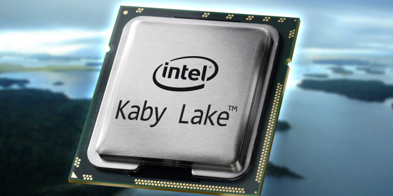

Have you ever been in a Google Hangout video call on a Chromebook and watch the battery life quickly drop while the device gets really hot? That's because your video output uses a software encoder for the VP8 codec used in Hangouts, according to the Chromium OS team, which can overly tax the processor.

The team hopes to address this by using [hardware acceleration for VP8 encoding in Hangouts](https://groups.google.com/a/chromium.org/forum/#!topic/blink-dev/vbYCDv5ve5w) on [new Chromebooks using Intel's Kaby Lake chips](https://www.aboutchromebooks.com/news/nocturne-to-be-a-chrome-os-detachable-with-high-res-display-and-fingerprint-reader/). Or at the very least, they intend to test hardware acceleration to see if it helps reduce both CPU usage -- which causes heat -- and the use of a cooling fan on the CPU to draw off that heat. A positive result would be more battery life and less fan noise while in a video call.

This is just a [formal intent to experiment internally with the Hangouts team](https://docs.google.com/document/d/e/2PACX-1vRsuaVygJWl99YP5csNFWJYFW8ItqkDDfM0qSjfG1T5v1YaYG2HF6jTvgsOERZMm0IwhD8P0RPebXxf/pub), known as an origin trial. So it's not likely we'll see this feature available outside of Google, which would be a field trial. If the origin trial is positive, however, Google could, and likely would, expand testing beyond the Hangouts team.

When I worked at Google, I was remote four days a week, so I **_lived_** on Hangouts on my Chromebook to communicate with my team through video calls. And I remember my battery getting eaten alive by those calls, so I was often limited to working while plugged in, which defeated the purpose of having a laptop to a point.

Consumer users of Chromebooks don't likely sit on Hangouts calls for hours each day, so this may not sound like a big deal to you. But in the business space, video calls can take up a large portion of the day, so hardware acceleration for Hangouts on newer devices would be a very welcome development.
