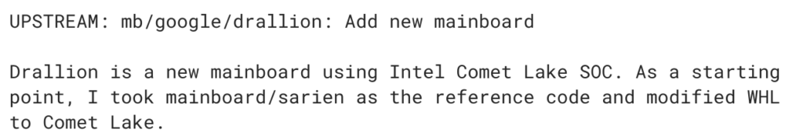

Earlier this month, I noted a [new Chrome OS baseboard dubbed Drallion that had chipset references to CML](https://www.aboutchromebooks.com/news/new-drallion-chromebook-boards-appear-with-wi-fi-6-and-intel-comet-lake-references/). I speculated that CML stood for Comet Lake and it turns out that speculation was correct.

Intel earlier today officially introduced its Comet Lake chipsets and I see updated [Chromium code commits specifically mentioning Comet Lake for Drallion](https://chromium-review.googlesource.com/c/chromiumos/third_party/coreboot/+/1739992).

Let's turn to Intel's Comet Lake information before discussing what it will bring to Chromebooks. [AnandTech has a super detailed overview of these new chipsets](https://www.anandtech.com/show/14782/intel-launches-comet-lakeu-and-comet-lakey-10th-gen-core-for-low-power-laptops), which are officially 10th generation processors but still use a 14-nanometer process. Intel's previously announced IceLake chips, by comparison, use a 10-nanometer process: That fits more transistors into a chip, which helps reduce power consumption.

Regardless, Intel says to expect up to a 16 percent performance increase over the previous generation U-Series chips. Here's a rundown of the Comet Lake chips to expect in any Chromebooks built on the Drallion baseboard:

Credit: Intel

The lineup looks similar to the current 8th-gen chips used in recent high-end Chromebooks and the Pixel Slate, as there are both U- and Y-Series processors. Power consumption appears to be a little bit lower on the new Comet Lake chips and some variants have more processor cores and threads than the previous generation. Unfortunately, Comet Lake processors don't get Intel Iris graphics; those are reserved for Ice Lake.

Regardless, as I previously noted, Comet Lake when paired with Intel Harrison Peak Wi-Fi brings Wi-Fi 6 for faster wireless data transfer speeds, provided you have a Wi-Fi 6 router. And the chipset supports LPDDR4X memory which can transfer data at 4266 Mbps. There's no guarantee we'll see this speed RAM in Chrome OS devices, but at least the baseboard and chipset are capable of using them.

Given the just released news of Comet Lake and that fact that Drallion only appeared in the Chromium repository this month, I'd be shocked if we saw the end result in the form of a Comet Lake Chromebook by next summer. My thinking: It's a second-half of 2020 device.
