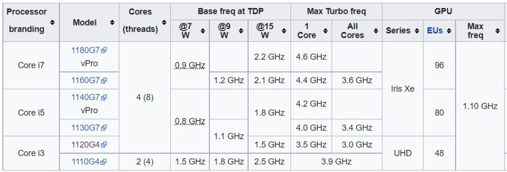

I was checking some details on the [Chromium Developer site](https://www.chromium.org/chromium-os/developer-information-for-chrome-os-devices) this afternoon and stumbled across a new Chromebook entry. There's not much there in terms of details but a 14-inch Asus Chromebook using the "Copano" board is in the works. One item for Copano jumped out at me. This Chromebook will use the Intel Tiger Lake UP4 silicon, on the right, above.

I did some digging and found some interesting information about the Intel Tiger Lake UP4 inside this 14-inch Asus Chromebook.

## What is Intel Tiger Lake UP4?

The UP4 line is a lower-powered version of the current Tiger Lake processors used in the updated [Acer Chromebook Spin 713](https://www.aboutchromebooks.com/news/acer-chromebook-spin-713-sale-discount-deal/) and [Asus Chromebook CX5](https://www.aboutchromebooks.com/tag/asus-chromebook-cx5/). And by lower-powered, I mean they use less power.

The Tiger Lake UP3 chipsets in the Spin 713 and CX5 can scale from using 12 to 28W of power. The Tiger Lake UP4 inside Copano will scale from 7 to 15W, by comparison.

[Intel has a chart here identifying the differences between the UP3 and UP4 chips](https://www.intel.com/content/www/us/en/newsroom/news/11th-gen-tiger-lake-evo.html) if you want full details on clock speeds, frequencies, and more. And here's a [summary of Intel Tiger Lake UP4, consolidated on Wikipedia](https://en.wikipedia.org/wiki/Tiger_Lake#Mobile_processors_(UP4-class)):

Essentially, the approach seems similar to the Core m3, m5, m7 processors found in some Chromebooks, like the [Pixel Slate](https://www.aboutchromebooks.com/reviews/google-pixel-slate-review/), a few years back.

The base clocks of the UP4 chips are around 1GHz, for example, under little to no load. The [UP3 CPUs](https://en.wikipedia.org/wiki/Tiger_Lake#Mobile_processors_(UP3-class)) are around 20 to 25% faster in a similar use case as they're using more power. And the base frequency of a Tiger Lake UP4 is in the 1.5 to 2.5 GHz range. The current Tiger Lake UP3 base frequencies go from 2 to 3 GHz.

So it sounds like a 14-inch Asus Chromebook built on Copano won't have _quite_ the performance levels of the Spin 713 or CX5. But it would likely run longer, assuming the same battery capacity as those. These CPUs are definitely aimed at traditional mobile devices such as tablets and laptops. That doesn't mean they're slouches though.

## What else do we know about this 14-inch Asus Chromebook?

I see support for Thunderbolt 4 and up to four external displays with resolutions up to 4096 x 2304 @ 60Hz over HDMI. Display Port support is there for an even higher resolution: 7680 x 4320 @ 60Hz.

That doesn't mean Copano or other Chromebooks using this silicon will actually support four external displays, but the capability is there in the chipset.

Speaking of displays, I see [Chromium code for Copano](https://chromium-review.googlesource.com/q/copano) mentioning a particular touchscreen panel by AUO. I looked up the model and it's a 14-inch 1920 x 1080 display.

I also noticed gyroscopic sensors in the lid and figured this to be a convertible design. But Google's Chromium Developer page clearly lists this as a Chromebook and not a convertible. At least for now. Also spotted: code indicating a pair of USB Type-C ports and at least one USB Type-A.

All in all, we have a high-level idea of what to expect from Copano when the device is completed and Asus rolls it out. Stay tuned for more information as it becomes available.
