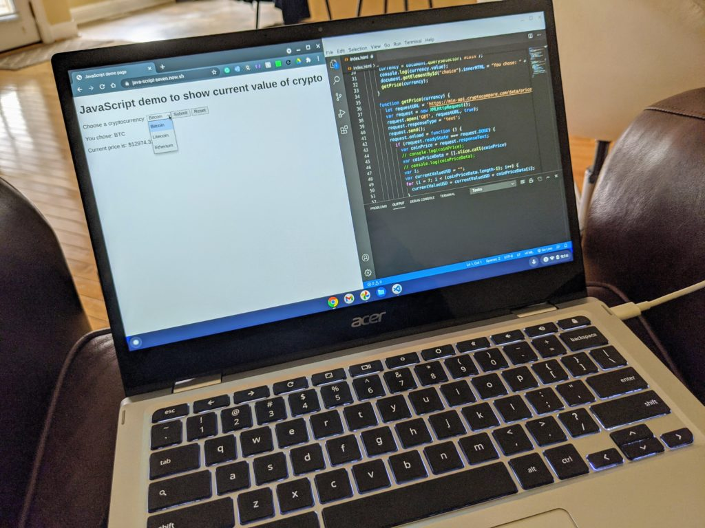
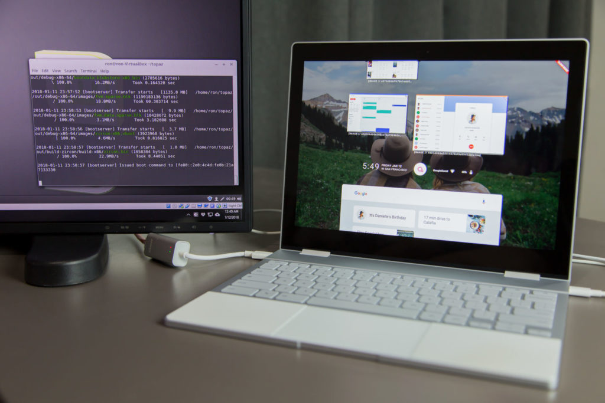

Since 2016 when it first appeared, Google's Fuchsia effort has been shrouded in mystery.

If you're not familiar with Fuchsia, [Google describes it](https://fuchsia.dev/fuchsia-src/concepts) as a "new open-source operating system" that can be scaled to run on small microcontrollers all the way up to traditional computing devices. Unlike Chrome OS, which runs on a Linux kernel, [Fuchsia will have its own microkernel called Zircon](https://fuchsia.dev/fuchsia-src/concepts/kernel).

Up until now, I didn't see Fuchsia having much future impact to Chromebooks.

Sure the potential was there, but replacing Chrome OS isn't what I'd call low-hanging fruit.

However, [this finding from 9to5 Google has me rethinking things](https://9to5google.com/2021/02/12/google-fuchsia-os-android-linux-programs-starnix/): Google is looking into Fuchsia support for native Android and Linux apps. And that screams "Chrome OS" to me.

## Goodbye VMs and containers on Chromebooks

The idea here is that Google would implement a translation service called Starnix into Fuchsia.

At a high level, Starnix sounds similar to [Apple's Rosetta 2 solution](https://developer.apple.com/documentation/apple_silicon/about_the_rosetta_translation_environment) for the new M1-based MacBook Air and MacBook Pro.

Rosetta 2 is a translation service that takes applications written for Intel x86 processors and allows them to run almost seamlessly on the ARM-based Apple Silicon M1 chip. I've used Rosetta 2 on my own M1 MacBook Air and have yet to encounter any software issues; it's impressive.

Today on Chromebooks, both Android and Linux apps run in separate containers for security and platform reasons. And in the case of Linux apps, inside the container is a virtual machine. So there's some resource overhead here.

That's what makes Starnix different. It would allow current Android and Linux apps to run natively, albeit in a translation method.

[This technical description](https://fuchsia.googlesource.com/fuchsia/+/2940d6f300031e852333c3ee0548ecba1d69c961/docs/contribute/governance/rfcs/NNNN_starnix.md#as-she-be-spoke) illustrates the difference from a Linux app perspective:

> The most direct way of running Linux binaries on Fuchsia would be to run those binaries in a virtual machine with the Linux kernel as the guest kernel in the virtual machine. However, this approach makes it difficult to integrate the guest programs with the rest of the Fuchsia system because they are running in a different operating system from the rest of the system.
> 
> Fuchsia is designed so that you can _bring your own runtime_, which means the Fuchsia system does not impose an opinion about the internal structure of components. In order to interoperate as a first-class citizen with the Fuchsia system, a component need only send and receive correctly formatted messages over the appropriate `zx::channel` objects.
> 
> Rather than running Linux binaries in a virtual machine, `starnix` creates a _Linux runtime_ natively in Fuchsia. Specifically, Linux program can be wrapped with a _component manifest_ that identifies `starnix` as the _runner_ for that component. Rather than using the _ELF Runner_ directly, the binary for the Linux program is given to `starnix` to run.

Technical mumbo-jumbo aside: What could this mean for Chrome OS and Chromebooks?

## What are the benefits of Fuchsia and Starnix?

It would certainly be feasible for Google to transition from Chrome OS to Fuschia, while not only maintaining near- or total compatibility, but also removing some overhead required to run Android and Linux apps. Essentially, these (particularly Linux) could see a noticeable performance improvement.

Does all of this mean Google **_will_** make that transition? No, of course not. However, it would make sense in the long-term. Not only could end-users benefit from better performance but Google wouldn't have to rely on using the Linux kernel to underpin Chrome OS.

An early build of Google Fuchsia running on the Pixelbook. Image courtesy [ArsTechnica](https://arstechnica.com/gadgets/2018/01/googles-fuchsia-os-on-the-pixelbook-it-works-it-actually-works/)

And it would add the potential for a single kernel across all Google devices: Chromebooks, yes, but also Android phones, Google Nest speakers and smart displays, etc...

I'm sure that there would be some pain points involved in any such transition as it pertains to Chromebooks. I wouldn't expect a Fuchsia-based Chromebook to "just work" on day one; it takes time to mature a platform, [as we've seen from a decade of Chrome OS](https://www.aboutchromebooks.com/news/chrome-os-is-10-years-old-heres-the-first-demo-from-2009/).

But I'm intrigued by this effort if it can make Chromebooks better in the long term.
