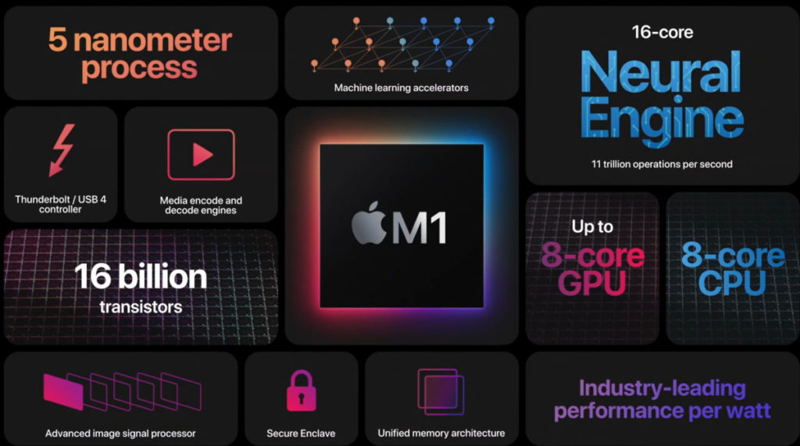

On its Cloud Blog today, [Google introduced Uri Frank its new VP of Engineering](https://cloud.google.com/blog/topics/systems/the-past-present-and-future-of-custom-compute-at-google) for server chip design. However, this doesn't preclude future efforts that would support [rumors of custom Google Chromebook chips](https://www.aboutchromebooks.com/news/here-are-the-reported-specs-of-the-google-samsung-exynos-chips-for-phones-and-chromebooks/). Frank has 25 years of experience leading the design of custom CPU chips and was most recently the head of Intel's Core & Client Development Group.

Much of Google's news is related to general computing advancement but it's clear that Frank's initial priority will be in Google Cloud infrastructure. It makes sense for custom silicon in Google data centers for AI, ML, and big data as the cloud matures:

> Compute at Google is at an important inflection point. To date, the motherboard has been our integration point, where we compose CPUs, networking, storage devices, custom accelerators, memory, all from different vendors, into an optimized system. But that’s no longer sufficient: to gain higher performance and to use less power, our workloads demand even deeper integration into the underlying hardware. 

Cloud hardware aside, Chrome OS is actually part of the Google Cloud organization at Google. And here's where Frank's expertise could fit in to the Chromebook hardware world: Custom designed systems-on-a-chip optimized for the best Chrome OS experience possible.

Indeed, after buying and using [an Apple M1 MacBook that uses Apple's own custom SOC based on the ARM architecture](https://www.aboutchromebooks.com/news/all-the-great-apple-silicon-m1-device-reviews-make-me-wish-for-chromebooks-with-google-made-chips/ "https://www.aboutchromebooks.com/news/all-the-great-apple-silicon-m1-device-reviews-make-me-wish-for-chromebooks-with-google-made-chips/"), I think it's even more likely that Frank's hire eventually brings Google silicon to Chromebooks.

If not, Google becomes completely reliant on and limited by, its CPU partners such as Intel, AMD, Samsung, MediaTek, and others.

Here's how I see it.

Google already controls the software stack of Chrome OS. Hardware partners typically can't add bloatware or their own customizations. This ensures that every Chromebook works like and provides the experience of every other Chromebook. The only difference is in the form factor and underlying hardware such as the processor, memory & storage capacity, and display.

And Google already tests and certifies the hardware options. A company like Dell or HP, simply can't design all the interls of their own laptop and slap Chrome OS on it. Google itself does all of the integration work to ensure the software and hardware work together. But again, the company has to deal with the limitations of the hardware vendors.

If Google wanted to certify a Chromebook board to use some new technology not yet supported by the processor being used, for example, it simply can't. But if Google could build a custom chip that does support the technology, that limitation is removed.

It's a more Apple-like approach. And whether you're an Apple device fan or not, it's hard to argue the benefits of controlling both the hardware and software stack.

Yes, Google could work an existing ARM partner to bring its own "branded" processors to Chromebooks. The early rumors were that Samsung would be that partner.

But if Samsung designs it for multipurpose use -- think Android phones, tablets, and Chrome OS devices -- it's really not the optimized solution that would benefit Chromebooks.

It doesn't matter who's name is on the chip: If Google doesn't take its Chrome OS expertise and design a chip to maximize performance and battery life, then it's not a custom chip for Chrome OS.

Clearly, I'm taking a leap into the future on this news of Frank's hire at Google. There's as much chance I'm wrong as I am correct. But I'd really like to be correct on this one. With custom processors, Google can take Chromebooks to the next level, much as Apple has done with its latest MacBooks and MacBook Pros.
