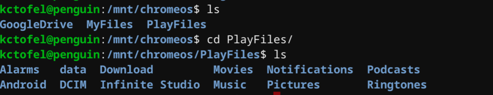

While using Linux on a Chromebook is helpful, if something happens to the Linux container, you could easily lose all of your installed apps, data, and settings. There is a manual method to import and export a container if you're familiar with [LXD in Linux](https://linuxcontainers.org/lxd/getting-started-cli/), but Crostini in Chrome OS is getting a native function to do the same according to the Chromium commit log.

The "**Implement export and import for crostini container**" effort actually [surfaced back in December](https://bugs.chromium.org/p/chromium/issues/detail?id=912638), but in the past few weeks, quite a bit of the code needed for this has been written. First was the ["crostini-backup" flag](https://www.aboutchromebooks.com/news/chrome-os-73-dev-channel-adds-google-drive-play-files-mount-in-linux-usb-device-management-and-crostini-backup-flag/) that was added to enable or disable the functionality. And last week a number of commits to support the importing and exporting of Crostini containers were added to Cicerone, the Chrome OS daemon that communicates with containers.

For a listing of [everything involved to make Crostini work, you can view all the bits and their definitions here](https://chromium.googlesource.com/chromiumos/docs/+/master/containers_and_vms.md#Glossary).

One of the Crostini parts buried in the definition document is making several appearances in the code for Crostini backups, namely [Tremplin, which appears to be the service that will manage and execute the container backup and restore process](https://chromium.googlesource.com/chromiumos/platform/tremplin/+/9a9fab4ae4e84b1c819aa8b8790846af52280117/src/chromiumos/tremplin/tremplin.go?autodive=0%2F). I found mention of [Tremplin in a bug report from last May](https://bugs.chromium.org/p/chromium/issues/detail?id=844079) since the original method to use containers -- still in use today -- is a shell script that wasn't meant to be a long term solution; Tremplin was envisioned as a way to use APIs with LXD for containers:

> [Tremplin](https://chromium.googlesource.com/chromiumos/platform/tremplin/+/master/) is a daemon that runs in the [VM](https://en.wikipedia.org/wiki/Virtual_machine) to provide a gRPC wrapper for LXD. This includes basic functionality such as creating and starting containers, but also provides other [Crostini](https://chromium.googlesource.com/chromiumos/docs/+/master/containers_and_vms.md#Crostini)\-specific integration such as setting up a container's primary user, and setting up apt repositories in the guest to match the Chrome OS milestone.

Technical terms and funky names aside, the gist is that once Tremplin is implemented, not only will Linux containers on Chrome OS be started and stopped by this new service but you'll be able to backup and restore your containers.

Since I'm [using my Pixel Slate for this semester's CompSci class](https://www.aboutchromebooks.com/news/how-to-code-on-a-chromebook-crostini-pixel-slate/), for example, this will be a very welcome addition. Currently, if I lose my Linux container, I can lose all of my coding assignments and third-party development tools. At the moment, I'm saving my code files in the cloud to offset some of the risks -- GitHub and the new [Google Drive mounting in Crostini](https://www.aboutchromebooks.com/news/chrome-os-73-dev-channel-adds-google-drive-play-files-mount-in-linux-usb-device-management-and-crostini-backup-flag/) are saving my bacon -- but the ability to back up the entire container (and restore it, if needed) on a regular basis would also mitigate any data loss.

The current target for Templin's implementation of exporting and importing Crostini containers is Chrome OS 74, so bits and pieces of it should start appearing in the Canary channel if they haven't already.
