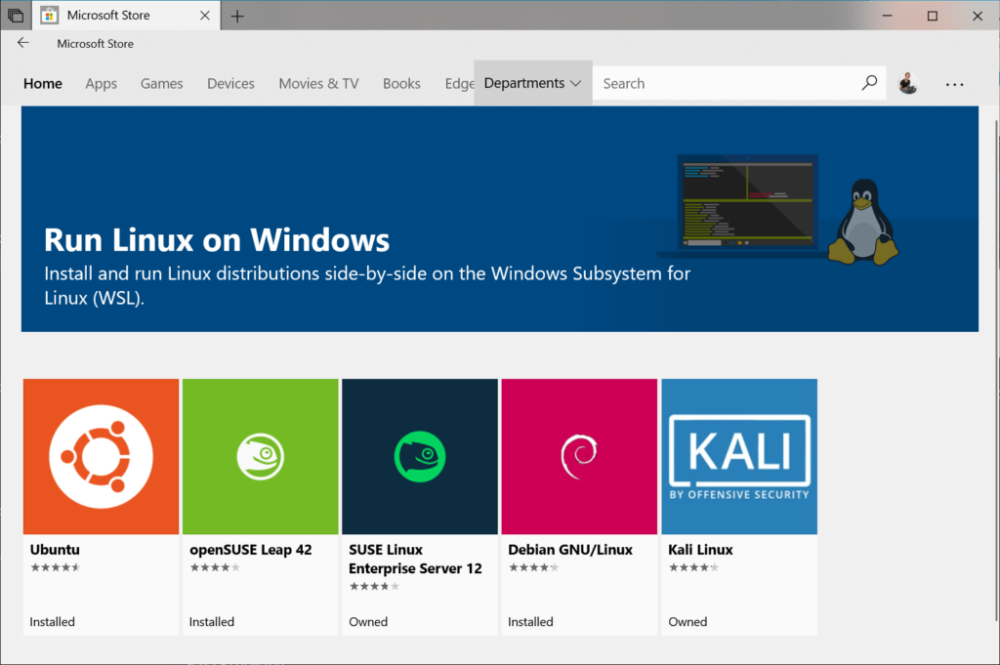
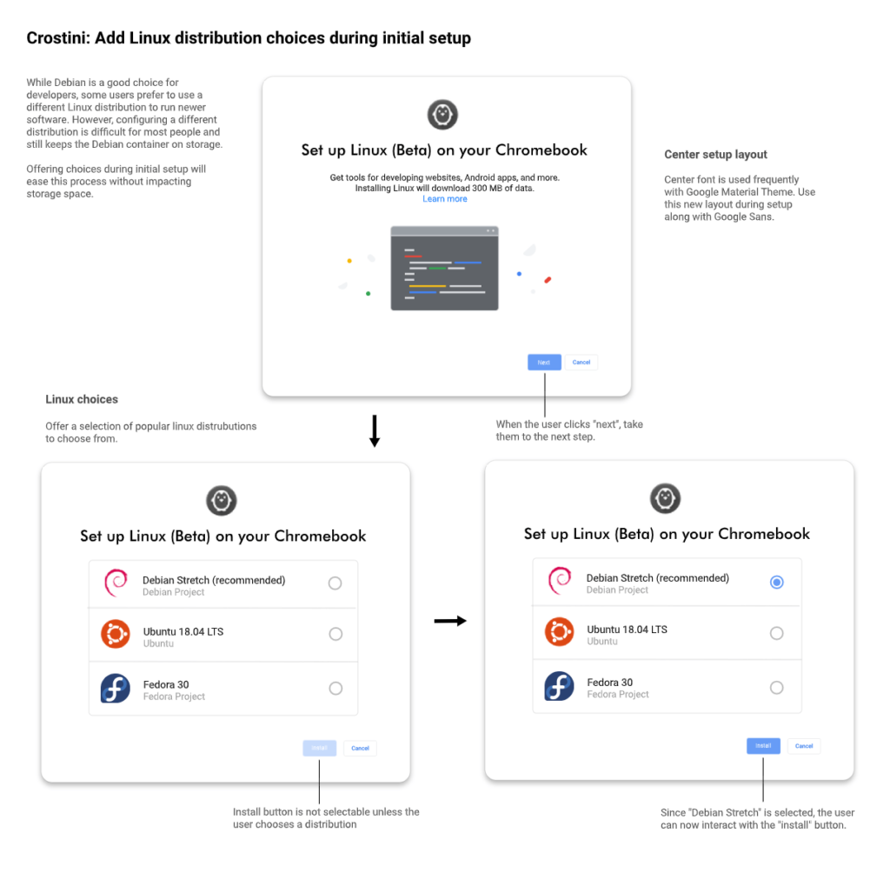
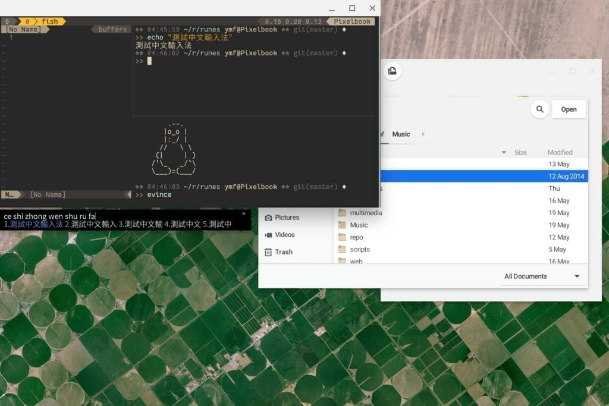

If you use the current [Linux for Chromebooks beta, also known as Project Crostini](https://www.aboutchromebooks.com/tag/project-crostini/), you probably have the Debian distro installed. That's the default flavor of Linux offered as of today. But a Crostini user recently [submitted a feature request to provide more options](https://bugs.chromium.org/p/chromium/issues/detail?id=998968), such as Ubuntu, Fedora or theoretically, any Linux distro that Google could possibly offer.

As of today, the request has been assigned to someone on the Chromium team and has a priority level of three; roughly meaning to me that_"it's not terribly important at the moment but we'll look into it."_

The feature request may never happen but that would be a shame, in my opinion, particularly in light of Microsoft's recent Linux efforts. In Windows 10, not only can you install the Linux subsystem, [but you get your choice](https://docs.microsoft.com/en-us/windows/wsl/install-win10), as shown:

Indeed, the person who proposed the feature request went as far to create a mock user interface for when a Chrome OS device owner enables the Linux for Chromebooks beta. I have to say, it looks quite nice!

As it stands today, you actually can install a different Linux platform on Chrome OS. However, it's not user-friendly for those just starting out with Linux. According to the FAQs of the official Crostini documentation, when asked [if different Linux distros can be installed](https://chromium.googlesource.com/chromiumos/docs/+/master/containers_and_vms.md#Can-I-run-a-different-Linux-distro), here's the answer:

> Of course! The full LXD command line is available, and the included images remote has lots of other distros to choose from. However, we don't test with anything other than the default container that we ship, so things may be broken when running another distro.

So if you're new to Linux, you likely have no idea what LXD is. If you're interested though, [here's the best resource to get started](https://linuxcontainers.org/lxd/introduction/). And if you want to run a different Linux on your Chromebook now, [you can do so with these command-line instructions](https://www.reddit.com/r/Crostini/wiki/howto/run-other-distros). Just keep in mind that those distros aren't coming from Google, so there could be some Chrome OS and Crostini integrations that don't quite work correctly.

One Reddit user has put together a fantastic guide on [setting up Ubuntu within Chrome OS](https://www.reddit.com/r/Crostini/wiki/howto/run-ubuntu), while another [has done the same for Arch Linux](https://www.reddit.com/r/Crostini/wiki/howto/run-arch-linux).

Credit: Tedyin.com

Note that I haven't tested either of these instruction sets because the default Debian container meets my current needs. If something _does_ go wrong when following either of these two processes, it's actually simple to get back to Debian: Just remove the Linux beta from your device and then re-enable it.

Take a look at the steps involved with either Ubuntu or ArchLinux and you'll see why the proposal to select your distro from a menu would be super handy.
