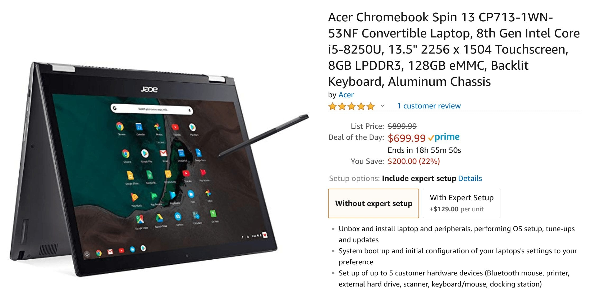

While I figured we'd see plenty of Chromebook deals for Cyber Monday, I didn't expect to see the brand new Acer Chromebook Spin 13 be one of them. And yet, it is. Normally priced at $899 for this configuration, [Amazon's Deal of the Day is the Chromebook Spin 13 for $699](https://www.amazon.com/gp/product/B07GD4CMDH/ref=as_li_tl?ie=UTF8&camp=1789&creative=9325&creativeASIN=B07GD4CMDH&linkCode=as2&tag=aboutchromebo-20&linkId=950d8080dfe64b4fbf30c4aaa2adedab) _(affiliate link)_.

This is the same [Acer Chromebook Spin 13 configuration I recently reviewed](https://www.aboutchromebooks.com/reviews/acer-chromebook-spin-13-review-vs-pixelbook/) and came away very impressed. In fact, I summed up the review by saying,

> Overall, the Acer Chromebook Spin 13 is the first Chromebook I’ve used that rivals or exceeds the Google Pixelbook. And it does so at a lower cost. That’s impressive.

The $200 off deal makes this 2-in-1 the same price as a discounted Pixelbook right now and to be honest, I'd probably lean towards this model due to the higher performance when compared to Google's flagship Chromebook.

But you don't have to spend $700 to get a decent Chromebook on Cyber Monday. Here are some other deals to consider today:

- [HP Chromebook X360 14 is $200 off at Best Buy](https://www.bestbuy.com/site/hp-2-in-1-14-touch-screen-chromebook-intel-core-i3-8gb-memory-64gb-emmc-flash-memory-hp-finish-in-ceramic-white-and-cloud-blue/6301869.p?skuId=6301869). For $449 you get the Core i3, 8GB of RAM, and 64GB of storage.
- [Asus Chromebook C223 can be had for $197](https://www.amazon.com/dp/B07G2XB2MB/ref=sspa_dk_detail_3?psc=1&pd_rd_i=B07G2XB2MB&pf_rd_m=ATVPDKIKX0DER&pf_rd_p=f0dedbe2-13c8-4136-a746-4398ed93cf0f&pd_rd_wg=0bogY&pf_rd_r=VKGTV68HC5H09WZPJ832&pf_rd_s=desktop-dp-sims&pf_rd_t=40701&pd_rd_w=ymhcO&pf_rd_i=desktop-dp-sims&pd_rd_r=1b566c4a-f17b-11e8-8ab7-d7d92181ecc1), down from its $229 price on Amazon. This new 11.6-inch Chromebook runs on a Celeron 3350, has 4GB of RAM and 32GB of storage. The display panel isn't the best for a basic Chrome OS laptop, the price is right.
- [Lenovo Yoga Chromebook  C630 is $120 off](https://www.lenovo.com/us/en/laptops/yoga/yoga-c-series/Yoga-Chromebook-C630/p/88YGCC61096) with a coupon code directly from Lenovo. You'll pay $479 for this 15.6-inch 1080p 2-in-1 powered by an 8th-gen Intel Core i3 with 8GB of RAM and 64GB of storage.
    
    \[caption id="attachment\_1579" align="aligncenter" width="800"\] Lenovo Yoga Chromebook C630\[/caption\]
- [Samsung's Chromebook Pro is down to $419](https://www.amazon.com/dp/B071LB1GG4/ref=sspa_dk_detail_0?psc=1&pd_rd_i=B071LB1GG4&pf_rd_m=ATVPDKIKX0DER&pf_rd_p=f0dedbe2-13c8-4136-a746-4398ed93cf0f&pd_rd_wg=8Va0q&pf_rd_r=W8CMY42D8T6HY86MYG93&pf_rd_s=desktop-dp-sims&pf_rd_t=40701&pd_rd_w=jHJL7&pf_rd_i=desktop-dp-sims&pd_rd_r=90483515-f17c-11e8-b0e1-cb0baae9fd4f) with a $130 savings on Amazon. Sadly, there's no support for Linux apps on this device yet, but if that doesn't matter, it's a solid 2-in-1 with a Core m3 processor, 4GB of RAM, 32GB of storage and a 2400x1600 resolution touchscreen, plus an integrated pen.
