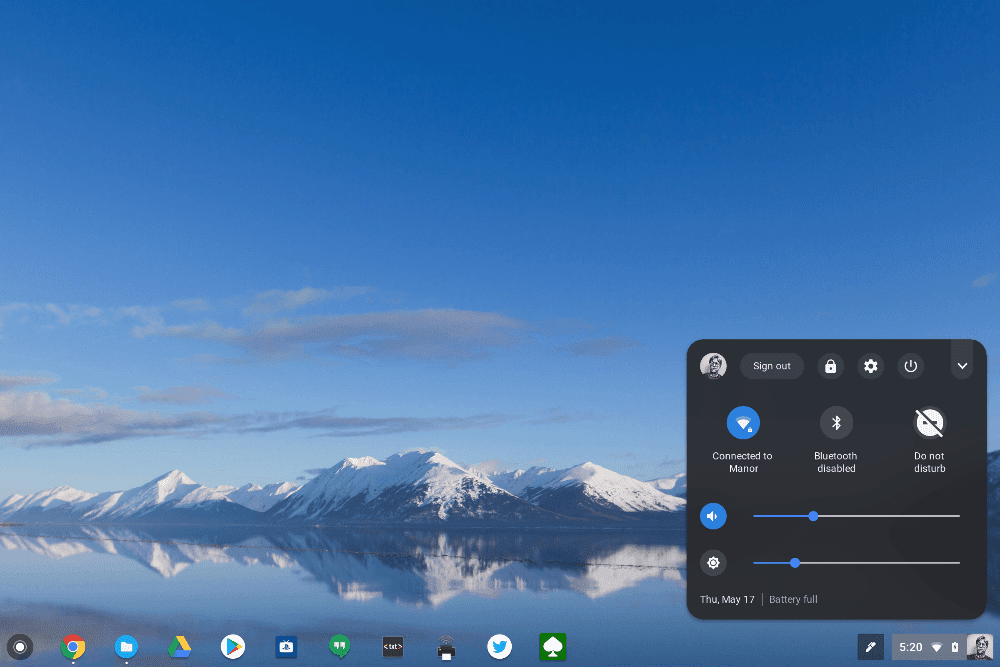

The "merger" of Android and Chrome OS continues with a new Chrome system tray settings updated that borrows some visual aspects from Android P.  [Reddit user JebusCL reported the change](https://www.reddit.com/r/chromeos/comments/8k0t3b/new_chromeos_ui/) which has a dark, modern theme and looks like this:

You can also tap the top right down arrow to show a condensed, compact view. I'm using this on my Pixelbook running the Chrome OS Dev Channel but this works on the Beta Channel as well per one of our readers (Thanks, Randy!). To enable it, type _chrome://flags_ in your browser and turn the following flags on:

- _Enable #enable-system-tray-unified_
    
- _Enable #enable-message-center-new-style-notification_
    
- _Enable #enable-new-app-menu-icon_
    

Google could change this new look-and-feel before the feature arrives on the Stable Channel, of course, but I like the style. And it's likely that the final presentation on Stable won't require any flag setting modification; it will simply be a part of native Chrome OS.
