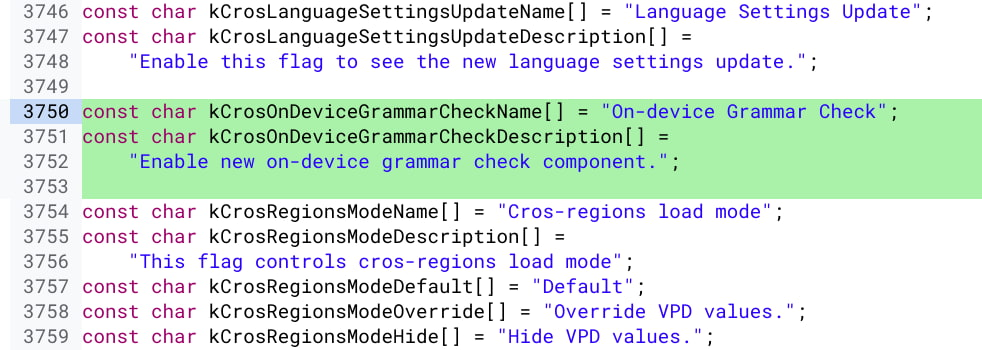

What ironic timing. I've been testing [some data privacy experiments](https://www.kctofel.com/the-experiment-living-a-mobile-life-without-apple-or-google/) by [not using any "big tech" on my personal smartphone](https://www.kctofel.com/living-a-mobile-life-without-apple-or-google-part-2-apps-email-cloud-storage/) lately. Now, [thanks to Chrome Story](https://www.chromestory.com/2020/11/chromebook-grammar-check/) I see that Google is working on a [Chrome OS grammar checking function](https://chromium-review.googlesource.com/c/chromium/src/+/2560081). Yes, if you use Google Docs or other Google services on your Chromebook, you've likely seen grammar checks. The difference with what's in the works is that it will happen locally on your device.

I actually use [Grammarly's](https://app.grammarly.com/) cloud service (shown above) for additional spelling and grammar checks these days. But I'd **_much_** rather prefer a native option that works across all of Chrome OS.

This would mean regardless of the app or site I'm using, I'd have much less chance of grammar errors. And given my latest data privacy experiments, I appreciate that the processing would be handled locally on my Chromebook.

Like most new features, the on-device grammar check will at first be hidden by an experimental flag:

At the moment, this flag isn't even available in the latest Canary Channel of Chrome OS and we're past the feature freeze of Chrome OS 88. So this could make it into Chrome OS 89, [currently expected around March 9, 2021](https://chromiumdash.appspot.com/schedule).

This thought about data privacy and using Chromebooks is an interesting one to me. You simply can't use a Chromebook without a Google / Gmail account, unless you simply use it in Guest Mode. Of course, that's not very practical.

And since I run a Chromebook site, I accept that Google and the various websites or services I use get some of my personal data. From a work perspective, I obviously won't be changing things up.

I'm curious what readers think though.

Do you take steps on your Chromebook to reduce the amount of private data you send out? I'm thinking at least some folks use privacy-centric Android or Linux desktop browsers for certain activities, but I could be wrong. Let me know!
