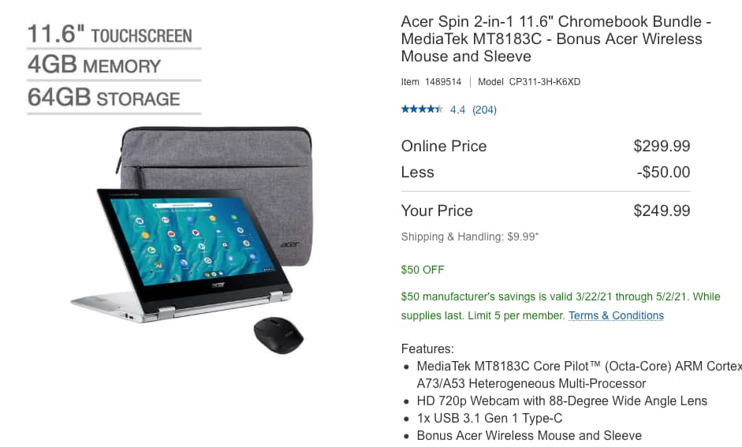
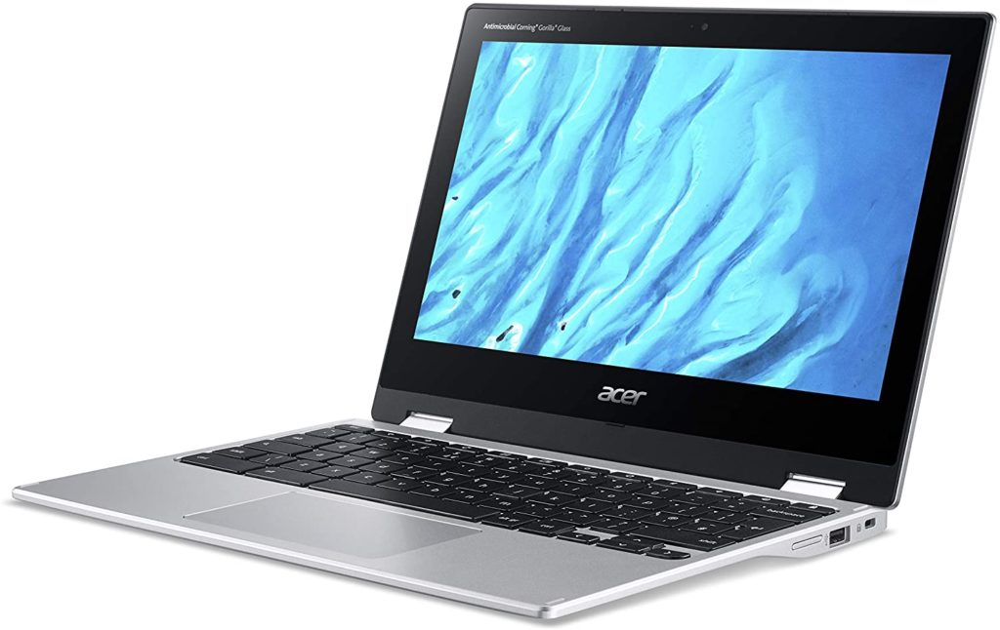

Although I haven't reviewed the updated Acer Chromebook Spin 311, I can safely estimate its performance. Built around the MediaTek 8183C processor, which is similar to that in the [excellent Lenovo Chromebook Duet](https://www.aboutchromebooks.com/news/my-pick-for-2020-chromebook-of-the-year/ "My pick for 2020 Chromebook of the year"), this should be a capable convertible Chromebook offering a similar experience. With a $50 discount, [Costco is selling the Acer Chromebook Spin 311 with MediaTek CPU for $249](https://www.costco.com/acer-spin-2-in-1-11.6%22-chromebook-bundle----mediatek-mt8183c---bonus-acer-wireless-mouse-and-sleeve.product.100696650.html "https://www.costco.com/acer-spin-2-in-1-11.6%22-chromebook-bundle----mediatek-mt8183c---bonus-acer-wireless-mouse-and-sleeve.product.100696650.html").

The package even includes a wireless mouse and laptop sleeve.

Considering that [Acer itself sells this model for $279 without the extras](https://www.acer.com/ac/en/US/content/model/NX.HUVAA.003 "https://www.acer.com/ac/en/US/content/model/NX.A6UAA.001"), this is a nice deal for basic low-end convertible Chromebook.

Obviously, at this price point, you're not getting all of the bells and whistles of a high-end Chromebook. Not even most of those found in a mid-range device either.

Still, for basic, everyday use? Well, plenty of folks are happy with the similar hardware of that Duet Chromebook, which tells you something.

<table><tbody><tr><td>CPU</td><td>Octa-core Mediatek 8183C, 2.0GHz</td></tr><tr><td>GPU</td><td>ARM G72 MP3</td></tr><tr><td>Display</td><td>11.6-inch 1366 x 768 matte LCD touchscreen</td></tr><tr><td>Memory</td><td>4 GB LPDDR4x</td></tr><tr><td>Storage</td><td>64 GB eMMC</td></tr><tr><td>Connectivity</td><td>Wi-Fi 5, Bluetooth 4.2</td></tr><tr><td>Input</td><td>Non-backlit keyboard with antimicrobial Gorilla Glass trackpad, 2 MP front camera</td></tr><tr><td>Ports</td><td>One USB Type-C (3.1 + DisplayPort) One USB Type-A</td></tr><tr><td>Battery</td><td>Claimed run-time of up to 15 hours</td></tr><tr><td>Weight</td><td>2.65 pounds</td></tr><tr><td>Software</td><td>Chrome OS automatic updates through June 2028</td></tr></tbody></table>

Sure, the display resolution isn't ideal. And a backlit keyboard would nice too. But all-day run-time for everyday browsing at home or on the go? It's hard to beat the price.

Don't take my word for it though.

Here's [an Android Central review of this model](https://www.androidcentral.com/acer-chromebook-spin-311-cp311-3h-review) to get a better understanding of what the Acer Chromebook Spin 311 delivers for the cost.

> Bouncing between a half-dozen tabs of reference while I write an article is smooth sailing, and while I'll confess an 11.6-inch screen is a bit cramped for split-screening, the Spin 311 still does well enough while I'm reformatting spec tables or referencing press releases while drafting something up. Photo editing through [Google Photos](https://www.androidcentral.com/google-photos) or [Pixlr E](https://pixlr.com/e/) is easy enough, even if I have to zoom in a little closer to make out if I got focus right on a picture or not.
> 
> Android Central

