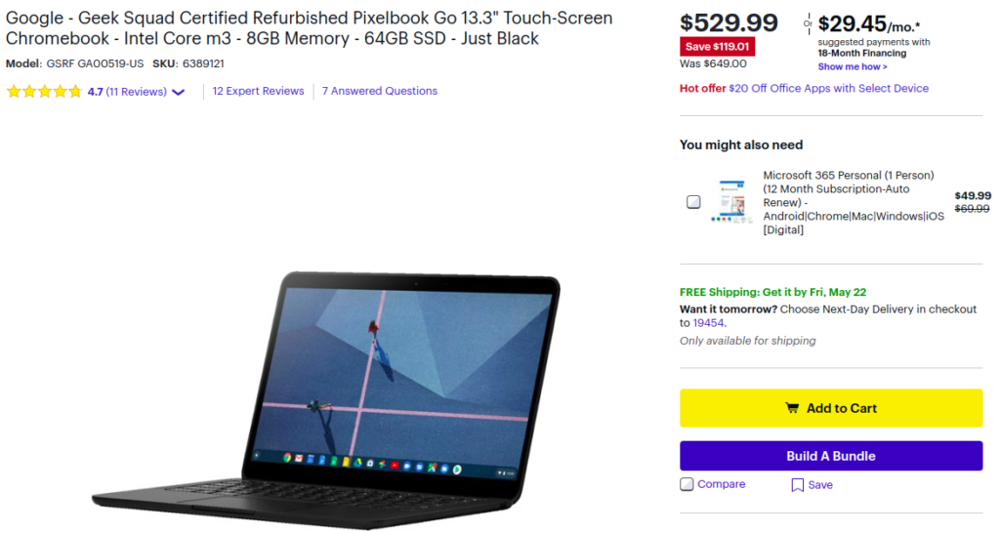
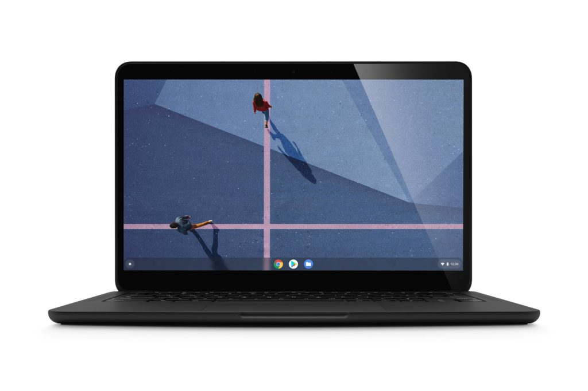

As long as you don't mind getting a refurbished unit, you can [snag the base model Google Pixelbook Go for $119.01 off at Best Buy](https://www.bestbuy.com/site/google-geek-squad-certified-refurbished-pixelbook-go-13-3-touch-screen-chromebook-intel-core-m3-8gb-memory-64gb-ssd-just-black/6389121.p?skuId=6389121). I noticed this deal last week but have been mostly offline due to some illness management. Frankly, I'm surprised this deal hasn't sold out during that time as I think the Core m3-powered Pixelbook Go is a fantastic device for the majority of Chromebook users.

Indeed, I called [the Pixelbook Go my Chromebook of the year for 2019,](https://www.aboutchromebooks.com/news/my-pick-for-2019-chromebook-of-the-year/) even with a few specific limitations that some people may not overlook.

What are they?

Well, if you can't live with a 16:9 widescreen display aspect ratio, the Pixelbook Go isn't for you. Nor if you want a 2-in-1 device with a display that folds 360-degrees for tablet usage; you can't do that with the Go, so logically, there's no digital stylus support either.

However, if you don't mind those missing features, you're getting a well-designed and built, super-thin Chromebook that will handle most, if not all, of your Chrome OS needs. And that's with the Core m3 processor, which is aided by 8 GB of memory.

When I dubbed this my top pick for 2019, it was for these reasons:

- Lighter and thinner than any similarly sized Chromebook.
- Better design and materials than most Chromebooks
- Speakers that are on par with, if not better than, those found in the Pixel Slate, which easily produces the best sound from any Chromebook.
- Improved hush-keys that are now what I consider the gold standard of Chromebook keyboards.
- Outstanding battery life in such a thin package

Many balked at the $649 entry level price tag, which I can understand if you're specifically looking for the best internal hardware at that price point.

You certainly can get a more powerful Chromebook for that amount of money. But you'll likely compromise on some other functionality such as battery life, weight and/or thickness, or the keyboard.

[Based on my initial review](https://www.aboutchromebooks.com/news/pixelbook-go-review-a-premium-price-validated-by-a-premium-device/) and [a follow up one fou](https://www.aboutchromebooks.com/news/pixelbook-go-review-2020/)[r](https://www.aboutchromebooks.com/news/pixelbook-go-review-2020/) [months later](https://www.aboutchromebooks.com/news/pixelbook-go-review-2020/), I think the Pixelbook Go is worth $649 for most people though, and at $529.99, that makes it even more attractive. Again, this is a refurbished unit, however, Best Buy's standard return period still applies.
