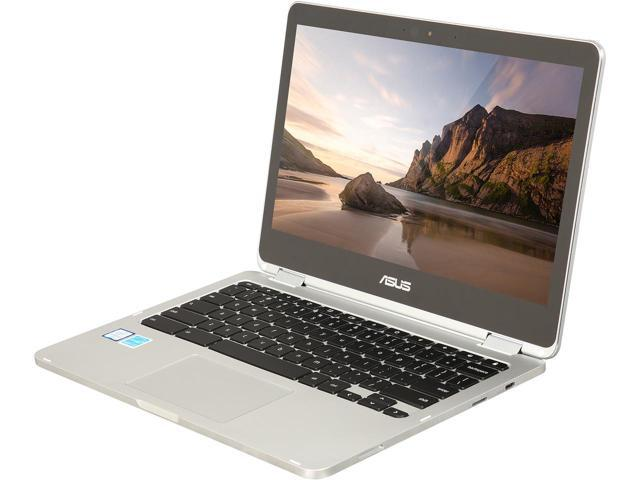

One of the best Chrome OS devices to launch last year was the [Asus Chromebook Flip C302](https://www.asus.com/us/Laptops/ASUS-Chromebook-Flip-C302CA/overview/). The 12.5-inch FullHD touch display folds 360-degrees for tablet mode like the more recent HP Chromebook X2, the device is powered by an Intel m3 processor, plus it comes with 64 GB of local storage. The typical C302 price is $499.99 but [Amazon has dropped it by $50, to $449.99](https://www.amazon.com/gp/product/B01N5G5PG2/ref=as_li_tl?ie=UTF8&tag=aboutchromebo-20&camp=1789&creative=9325&linkCode=as2&creativeASIN=B01N5G5PG2&linkId=f3addeb2677609d31e9a119bf5dddd41) (_affiliate link_). **_(Update: for Prime Day, this Chromebook is now $100 off: $399.99!)_**

<iframe style="width: 120px; height: 240px;" src="//ws-na.amazon-adsystem.com/widgets/q?ServiceVersion=20070822&amp;OneJS=1&amp;Operation=GetAdHtml&amp;MarketPlace=US&amp;source=ac&amp;ref=tf_til&amp;ad_type=product_link&amp;tracking_id=aboutchromebo-20&amp;marketplace=amazon&amp;region=US&amp;placement=B01N5G5PG2&amp;asins=B01N5G5PG2&amp;linkId=ff007075abd0c8347e99dde822c10cc6&amp;show_border=true&amp;link_opens_in_new_window=true&amp;price_color=333333&amp;title_color=0066c0&amp;bg_color=ffffff" frameborder="0" marginwidth="0" marginheight="0" scrolling="no" align="right"> </iframe>

Keep in mind that since the device is more than a year old, it runs on a sixth-generation Intel processor: The [Core m3-6Y30](https://ark.intel.com/products/88198/Intel-Core-m3-6Y30-Processor-4M-Cache-up-to-2_20-GHz). Even so, when I used the Flip C302, I found it pretty peppy, even with the base 4 GB of memory. This chip has a base clock speed of 900 MHz, but can ramp up to 2.2 GHz for short periods of time.

Like other current Chromebooks, the Flip C302 has a pair of USB-C ports for charging, video out and data transfers. And those ports are on both the right and left -- one on each side -- like the Pixelbook, so you can charge the laptop from either side. The left side also has a microSD card slot for external data storage. Battery life is rated at 10 hours, so this is generally an "all day" device. Bluetooth 4.0 and 802.11ac Wi-Fi round out the connection options.

About the only "gotcha" on the Flip C302 is the large screen bezels, but unfortunately, that appears to be a common feature of Chromebooks that double as tablets these days.

Given its 2017 launch, the Asus Chromebook Flip C302 does support the Google Play Store, so you can run Android apps on it. As far as [Project Crostini for Linux apps](https://www.aboutchromebooks.com/tag/project-crostini): That's not there yet.

However, the Core m3 is based on Intel's Skylake architecture and should be able to support Linux apps. The bigger issue is that the Flip C302 runs on version 3.18 of the Linux kernel, which won't support Crostini containers. [Google is working to backport the required modules on Chromebooks](https://www.aboutchromebooks.com/news/theres-hope-that-older-chromebooks-will-run-linux-apps-with-crostini/) with this kernel version, so don't count the Flip C302 out just yet for Linux apps.
