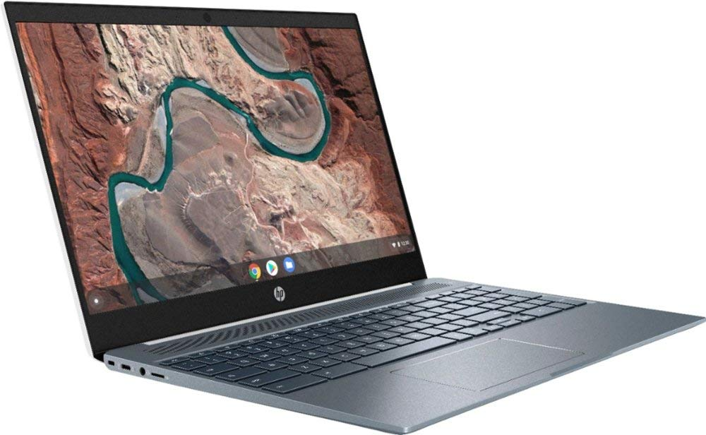
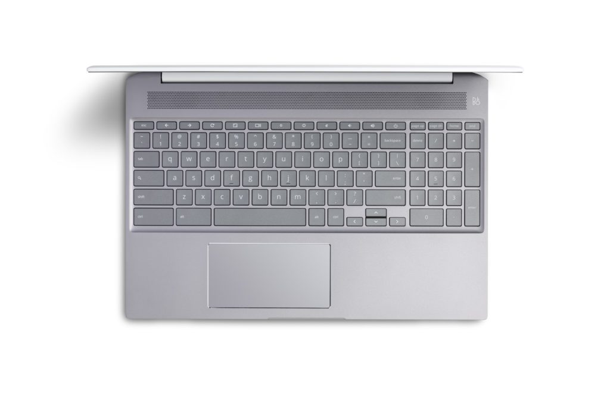

When the [HP Chromebook 15 debuted as the first Chromebook with a dedicated number pad last April](https://www.aboutchromebooks.com/news/hp-chromebook-15-numeric-keypad-price-specs-availability/), the Pentium model with 4 GB of memory was $449. Fast forward to today and you can nab the same 1080p clamshell with a much higher powered Core i5-8250U processor, double the RAM _**and**_ get a free external DVD drive for just $30 more.

[Amazon is currently showing this great value on the HP Chromebook 15 at $479](https://www.amazon.com/gp/product/B084C1DHFZ?pf_rd_p=ab873d20-a0ca-439b-ac45-cd78f07a84d8&pf_rd_r=2YWC0M1B4CXWPEH9RBNA).

For reference, [HP is selling a Core i3 model of this Chromebook for $619 directly](https://store.hp.com/us/en/pdp/hp-chromebook-15-de0015nr).

And I should note that [my Acer Chromebook Spin 13](https://www.aboutchromebooks.com/news/acer-chromebook-spin-13-with-16-gb-ram-should-you-buy-one/), which I use daily for heavy duty Linux apps and coding, uses this same Core i5 processor. Although I have 16 GB of memory in that device and the HP has half that, my device flies and costs $999 new.

Here's a rundown on the HP Chromebook 15 specs for the $479 price tag:

<table class=""><tbody><tr><td>CPU</td><td>Intel Core i5-8250U</td></tr><tr><td>GPU</td><td>Intel UHD Graphics 620</td></tr><tr><td>Display</td><td>15.6-inch IPS touch panel, 250 nits 1920 x 1080, 16:9 aspect</td></tr><tr><td>Memory</td><td>8 GB DDR4, 2133 MHz</td></tr><tr><td>Storage</td><td>128 GB eMMC, microSD card expansion slot</td></tr><tr><td>Connectivity</td><td>802.11ac, Bluetooth 4.2</td></tr><tr><td>Input</td><td>Backlit keyboard, multi-touch trackpad</td></tr><tr><td>Ports</td><td>2 USB Type-C, 1 USB Type-A, 720p webcam, microSD card slot, combo microphone/headphone</td></tr><tr><td>Battery</td><td>60Whr, claimed run-time up to 13 hours</td></tr><tr><td>Weight</td><td>3.99 pounds</td></tr><tr><td>Software</td><td>Chrome OS automatic update expiration date: June 2025</td></tr></tbody></table>

At four pounds, a light Chromebook this is not, although it's certainly portable in a backpack or messenger bag.

Weight is the tradeoff for a device this large, but it gains you a bigger display, dedicated numeric keypad and larger battery. I doubt most activities will net you the claimed 13 hours of run-time on a single charge, but 9 to 10 daily should be feasible.

Considering a [comparably configured Lenovo Chromebook Yoga C630 costs $549](https://www.amazon.com/Lenovo-2-1-Touch-Screen-Chromebook/dp/B07KKLBVVN) on Amazon right now, this HP Chromebook 15 deal is a good value if you're in the market for the largest Chromebook you can get and don't mind the clamshell form factor.
