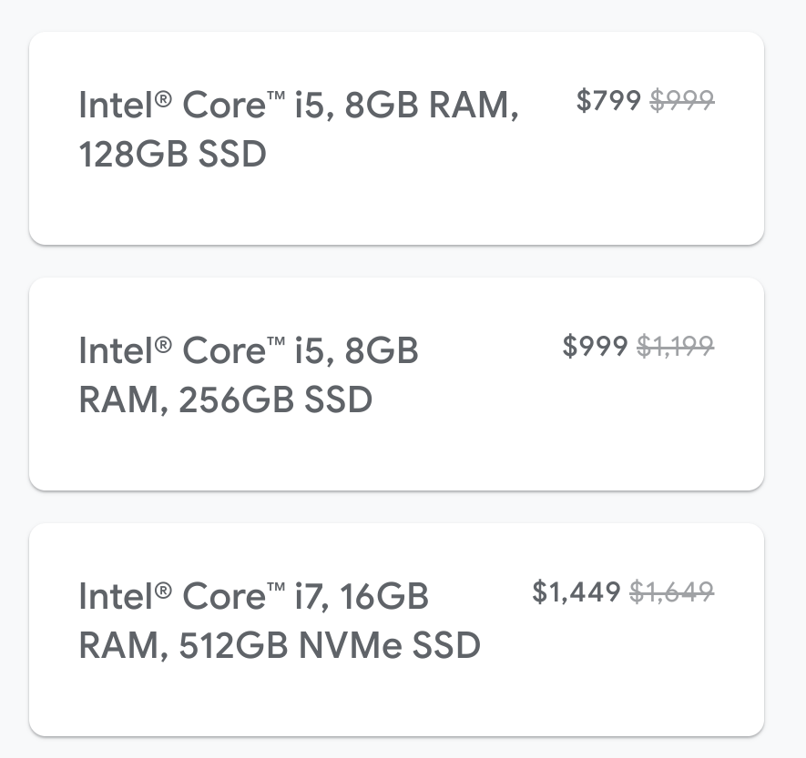
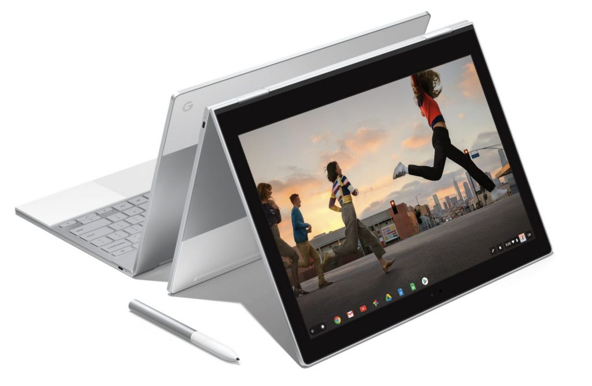

Although the $999 [Pixel Slate I bought is my full-time device](https://www.aboutchromebooks.com/news/how-to-code-on-a-chromebook-crostini-pixel-slate/), I've said more than once that most people would be better served by the $999 Google Pixelbook. And now it costs you $200 less thanks to current sale pricing on all Pixelbook models: You can nab a base Pixelbook, which is still an outstanding device, [for $799 from the Google Store](https://store.google.com/config/google_pixelbook).

<iframe style="width:120px;height:240px;" align="right" marginwidth="0" marginheight="0" scrolling="no" frameborder="0" src="//ws-na.amazon-adsystem.com/widgets/q?ServiceVersion=20070822&amp;OneJS=1&amp;Operation=GetAdHtml&amp;MarketPlace=US&amp;source=ac&amp;ref=qf_sp_asin_til&amp;ad_type=product_link&amp;tracking_id=aboutchromebo-20&amp;marketplace=amazon&amp;region=US&amp;placement=B075JSK7TR&amp;asins=B075JSK7TR&amp;linkId=6f88a4f5c06495b18cc2a5c0f56b5d4e&amp;show_border=true&amp;link_opens_in_new_window=true&amp;price_color=333333&amp;title_color=0066c0&amp;bg_color=ffffff"></iframe>

If you were on the fence between a Pixelbook and Pixel Slate, I recommend [asking yourself these two questions to help you decide](https://www.aboutchromebooks.com/opinion/google-pixel-slate-vs-chromebook-should-i-buy-chromeos-tablet/).

Of course, a comparable [Pixel Slate and the Pixel Slate Keyboard](https://www.aboutchromebooks.com/reviews/google-pixel-slate-review/) will cost you $1200, which _could_ influence your decision right now; the $799 Pixelbook model has very similar hardware.

Both devices include the same 8 GB of memory and 128 GB of storage and have Intel Core i5 processors.

The Pixelbook uses a seventh-gen Intel chip while the Pixel Slate is an eighth-gen version, but I see very little performance difference between my Slate and old Pixelbook.

The only other standout variance is that the Slate has a higher resolution 3000 x 2000 display while the Pixelbook screen is still super clear at 2400 x 1600 resolution.

If you'd rather not wait for Google to deliver your on-sale Pixelbook, [Best Buy is also selling it for the same $200 off](https://www.bestbuy.com/site/google-pixelbook-12-3-touchscreen-chromebook-intel-core-i5-8gb-memory-128gb-solid-state-drive-silver/6131501.p?skuId=6131501), regardless of configuration. And as an added bonus, it will throw in a free Google Home Mini as well!
