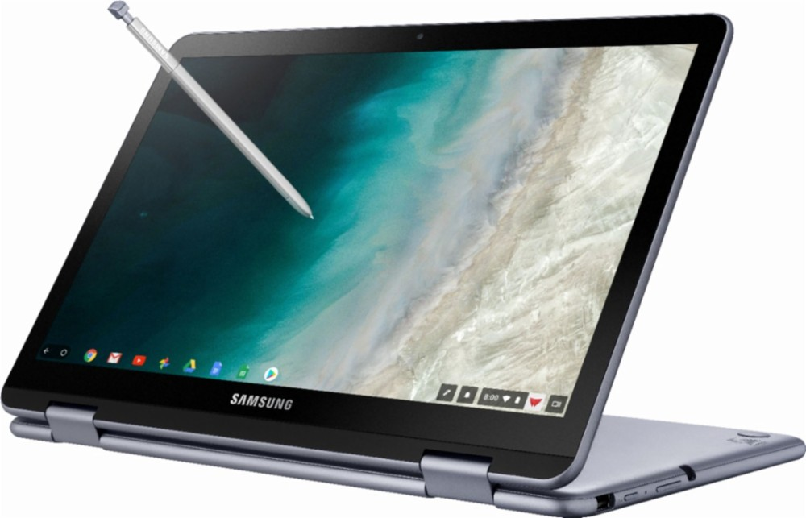

It's not often that Amazon's Deal of the Day is a Chromebook so its even rarer to see multiple Chromebooks discounted for 24 hours. But that's exactly what happened earlier today as Amazon has discounted the Samsung Chromebook Plus V2 and Samsung Chromebook Pro by 31- and 27-percent, respectively.

<iframe style="width:120px;height:240px;" align="right" marginwidth="0" marginheight="0" scrolling="no" frameborder="0" src="//ws-na.amazon-adsystem.com/widgets/q?ServiceVersion=20070822&amp;OneJS=1&amp;Operation=GetAdHtml&amp;MarketPlace=US&amp;source=ac&amp;ref=qf_sp_asin_til&amp;ad_type=product_link&amp;tracking_id=aboutchromebo-20&amp;marketplace=amazon&amp;region=US&amp;placement=B071LB1GG4&amp;asins=B071LB1GG4&amp;linkId=3092b0dd7bd75a6624c2a088746f68ee&amp;show_border=true&amp;link_opens_in_new_window=true&amp;price_color=333333&amp;title_color=0066c0&amp;bg_color=ffffff"></iframe>

The Samsung Chromebook Pro, on sale for $399.99 is a little longer in the tooth with its sixth-generation Intel Core m3 6Y-30 processor since the device was initially launched in May of 2017.

It's still a solid performer for most Chromebook activities though and is paired with 4 GB of memory and 32 GB of eMMC storage. There's also a microSD card slot for additional storage, and as we know, [Chrome OS has been improved for using external storage](https://www.aboutchromebooks.com/news/chrome-os-72-how-to-download-android-movies-music-to-sd-card-on-chromebook/). I do not believe this is the [updated model with a backlit keyboard](https://www.aboutchromebooks.com/news/new-samsung-chromebook-pro-now-has-a-backlit-keyboard/), however, based on the model number.

The killer feature to me at this price is the display on this 2-in-1: It's a super-sharp 12.3-inch 2400 x 1600 panel with 400 nits of brightness. That display is not only touch capable, but works with an included stylus for taking notes or drawing activities. If you're looking for a $399.99 Chromebook, it's worth the look.

<iframe style="width:120px;height:240px;" align="right" marginwidth="0" marginheight="0" scrolling="no" frameborder="0" src="//ws-na.amazon-adsystem.com/widgets/q?ServiceVersion=20070822&amp;OneJS=1&amp;Operation=GetAdHtml&amp;MarketPlace=US&amp;source=ac&amp;ref=qf_sp_asin_til&amp;ad_type=product_link&amp;tracking_id=aboutchromebo-20&amp;marketplace=amazon&amp;region=US&amp;placement=B07J1SY5QQ&amp;asins=B07J1SY5QQ&amp;linkId=ad55ef38f14cf64ef8c8c1e9aefc72e9&amp;show_border=true&amp;link_opens_in_new_window=true&amp;price_color=333333&amp;title_color=0066c0&amp;bg_color=ffffff"></iframe>

If you want to save $20, you can also choose the Samsung Chromebook Plus V2, which got [a refresh from the original model back in June, 2018](https://www.aboutchromebooks.com/news/samsung-chromebook-plus-v2-release-date-price/). You _might_ give up a little bit of performance capabilities as well as display resolution, but on the plus side, you'll get double the local storage.

This 2-in-1 runs on a seventh-generation Intel Celeron 3965Y chip, also has 4 GB of RAM and includes 64 GB of eMMC storage, plus a card slot for additional capacity. The 12.2-inch screen has 1920 x 1080 resolution and also works with the included stylus.

Again, there's no backlit keyboard to be had here. This is also not the [Chromebook Plus model with an integrated LTE radio](https://www.aboutchromebooks.com/news/samsung-chromebook-plus-v2-lte-release-date-specs-599-price-verizon/): It's Wi-Fi for connectivity, just as with the Pro edition.

Samsung typically sells these two Chromebooks directly starting at $499, so today's deal is pretty significant. I'm personally more inclined to spend more for higher performing devices based on my activities, but there are a ton of people who just want to quickly and securely browse the web, work with online apps or check email, and watch video. Either of these would be great choices as a "starter" Chromebook without breaking the bank.
