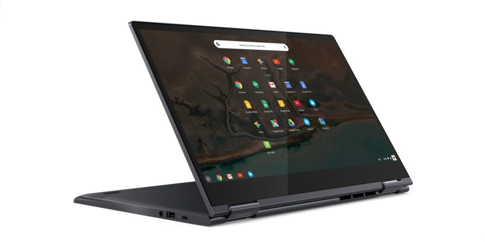

Yesterday, I got an email tip from reader George, telling me about a great deal on the HP Chromebook X360. Unfortunately, when the tip came in, I was in class nearly all day, thanks to finals week. Coming home for dinner and reading the note, I figured if this was a one day deal, it wasn't worth writing up at that point.

Good news though: [All this week, the HP Chromebook X360 is $200 off at Best Buy](https://www.bestbuy.com/site/hp-2-in-1-14-touch-screen-chromebook-intel-core-i3-8gb-memory-64gb-emmc-flash-memory-hp-finish-in-ceramic-white-and-cloud-blue/6301869.p?skuId=6301869), based on the retailer's weekly ad that I checked this morning. This week's sale also includes the [Lenovo Yoga C630 Chromebook at $100 off](https://www.bestbuy.com/site/lenovo-yoga-c630-2-in-1-15-6-touch-screen-chromebook-intel-core-i5-8gb-memory-128gb-emmc-flash-memory-midnight-blue/6295998.p?skuId=6295998) and if you purchase either of these Chromebooks you get a free Google Home Mini included in the deal.

The [HP Chromebook X360](https://www.aboutchromebooks.com/news/hp-chromebook-x360-release-date-price-specs/) is similar to the company's X2 although it's not a detachable screen Chromebook, it's larger a 2-in-1 one device with a 14-inch 1080p touchscreen.

It also has a newer Intel processor: For the $449.99 sale price, you're getting an eighth-generation Core i3 U-Series chip. Since the U-Series chips have a higher heat threshold under load, the X360 does have a cooling fan. And while the Core i3 clearly isn't the most powerful processor, it should be helped by the 8 GB of memory in the X360, which also has 64 GB of storage; double the memory and storage as the X2. At this price point, I think the X360 is a good value. Note that you can [purchase this Chromebook directly from HP,  but the current price is $599](https://store.hp.com/us/en/pdp/hp-chromebook-x360-14-da0021nr).

If $599 fits in your budget, that will get you the [Lenovo Yoga C630 Chromebook](https://www.aboutchromebooks.com/news/lenovo-yoga-chromebook-c630-price-availability-4k/) this week, down from its $699 price at Best Buy. 

<iframe style="width: 120px; height: 240px;" src="//ws-na.amazon-adsystem.com/widgets/q?ServiceVersion=20070822&amp;OneJS=1&amp;Operation=GetAdHtml&amp;MarketPlace=US&amp;source=ac&amp;ref=qf_sp_asin_til&amp;ad_type=product_link&amp;tracking_id=aboutchromebo-20&amp;marketplace=amazon&amp;region=US&amp;placement=B075JSK7TR&amp;asins=B075JSK7TR&amp;linkId=fcf74fa2f90192dfba894acdc6dfb195&amp;show_border=true&amp;link_opens_in_new_window=true&amp;price_color=333333&amp;title_color=0066c0&amp;bg_color=ffffff" frameborder="0" marginwidth="0" marginheight="0" scrolling="no" align="right"></iframe>

You get the same 8 GB of RAM as the less expensive HP Chromebook X360, but you gain more in the processor, local storage capacity and screen size. The C630 has a 15.6-inch 1080p touchscreen, 128 GB of storage and a step up to the Intel Core i5 U-Series processor. Yes, there's a fan in this device too.

Save for the fan and the screen size and resolution, you're essentially getting a Chromebook that has the same, but newer, internals as the base Google Pixelbook which is priced at $999 when not on sale.

Both are a bit large for my tastes, but if a big-screened Chromebook with the latest Intel chips is what you're looking for, this week might be the time to pull the trigger.
