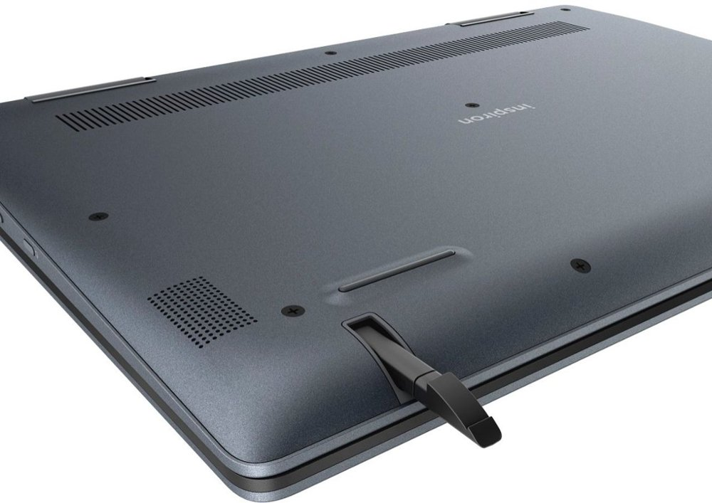

This week will be [all about the Pixelbook Go](https://www.aboutchromebooks.com/news/pixelbook-go-leaks-specifications-pricing-atlas/) since that device is expected to launch on Tuesday. I'll be at the New York City event and will share thoughts, of course.

But today is all about the Dell Inspiron Chromebook 14 if you're looking for a 2-in-1 device with a U-Series Intel Core i3 processor. Best Buy has slashed the normal $549 price tag by $150, bringing this [solid mid-range Chromebook down to $399](https://www.bestbuy.com/site/dell-inspiron-2-in-1-14-touch-screen-chromebook-intel-core-i3-4gb-memory-128gb-emmc-flash-memory-urban-gray/6299820.p?skuId=6299820).

Occasionally, I've seen $100 off on this Dell, although back in June, Best Buy was running the same $150 off promotion as they are today.

And what I said back then still holds true: If you don't mind an internal fan (which really shouldn't run often), $399 gets you a strong performing Chromebook with 1080p display and pen support, capable of fast browsing, multiple Android apps and even some Linux software if you decide to enable that option.

Here's a reminder of the hardware configuration:

- [Intel Core i3-8130U](https://ark.intel.com/content/www/us/en/ark/products/137977/intel-core-i3-8130u-processor-4m-cache-up-to-3-40-ghz.html) processor
- Intel UHD 620 integrated graphics
- 4 GB of memory
- 128 GB of eMMC storage and microSD card slot
- 14.0-inch FHD (1920 x 1080) TrueLife LED Backlight Touch IPS Display with EMR Pen Support (pen included)
- 720p webcam
- Two USB Type-C ports, one USB Type-A port, microphone/headphone jack
- 802.11ac Wi-Fi and Bluetooth 4.2
- 56 WHr battery and 45 Watt charger
- Weight of 3.99 pounds

About the only concern I'd have with the Dell is the 4 GB of memory, although unless you're more of a power user, this should be fine. Given that I code on my Chromebooks, I've always felt [the more RAM the better for my use case](https://www.aboutchromebooks.com/news/acer-chromebook-spin-13-with-16-gb-ram-should-you-buy-one/).

