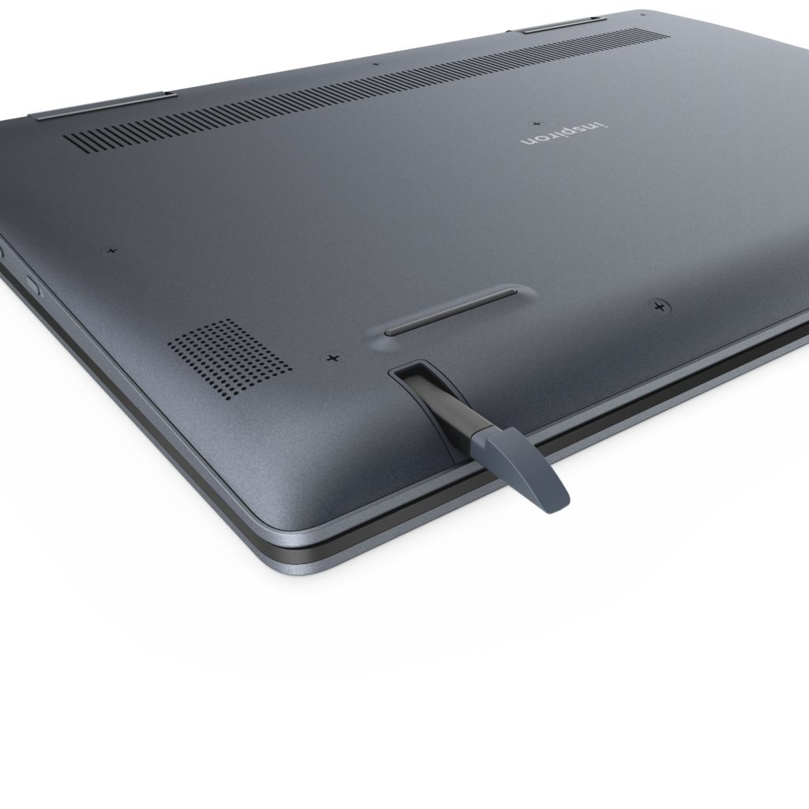

Back in August, [Dell surprised everyone](https://www.aboutchromebooks.com/news/dell-insipiron-14-chromebook-price-release-date-availability/) with a new 2-in1 laptop, [the Dell Inspiron Chromebook 14](https://www.dell.com/learn/us/en/uscorp1/press-releases/2018-08-29-dell-brings-new-modern-innovative-devices-for-consumers-and-small-businesses-at-ifa-2018). The company shared all of the specifications, the $599 price tag and availability of October 23. According to Best Buy, however, you'll see the [new Inspiron Chromebook 14 released this Sunday, October 21](https://www.bestbuy.com/site/dell-inspiron-2-in-1-14-touch-screen-chromebook-intel-core-i3-4gb-memory-128gb-emmc-flash-memory-urban-gray/6299820.p?skuId=6299820&ref=212&loc=1&ds_rl=1260666&ds_rl=1260576&ref=212&loc=1&gclid=CjwKCAjwgabeBRBuEiwACD4R5nWhqRAeGcFdgiQLcLtg6ooDpjUcmyH5icB9SWLG7Gre3pWsSjWMGxoCxV8QAvD_BwE&gclsrc=aw.ds). You can even pre-order online have it shipped by the release day to your home or to your local Best Buy store for pickup.

Just to make sure this wasn't a unique offer for my nearest store, I looked at others in my area and they all show the same availability: Order now and you can pick it up this weekend:

I may mosey into Best Buy on Sunday to take a closer look at the new Chromebook. Until then, I still think it _might_ much do better at a $499 or even $549 price point for the Intel [Core i3-8130U](https://ark.intel.com/products/137977/Intel-Core-i3-8130U-Processor-4M-Cache-up-to-3_40-GHz) powered laptop with 4 GB of memory, even though there is a generous 128 GB of eMMC storage. The Chromebook has 14-inch IPS touch display with1920 x 1280 resolution and there is an included EMR pen that's stored in the base of the laptop.

I also want to see how the battery life is although I don't think I can stay in Best Buy long enough for that: Dell says to expect 15 hours on a single charge. My guess is around 10 or 11 hours of typical mixed usage, although even on the low side, that's definitely what I'd consider "all day" runtime. Hopefully, you won't have to lug around the charger since the Chromebook is 3.99 pounds according to Dell. They just had to come in under 4 pounds, I suppose.

There aren't too many currently available Chromebooks with 8th-generation Intel chips, although several are on the way, so if I do get to see one of these new Dell's, I'll likely run a few benchmarks and get a feel for general usage performance. I'm not in the market for a large 2-in-1 device, so this isn't for me. If the Dell fits the bill for your use case though, you can have it in your hands shortly.

\[gallery type="slideshow" size="large" ids="1541,1532,1540,1539,1538,1537,1533,1534,1535,1536,1531,1530,1529,1528,1527,1522,1523,1524,1525,1526,1521,1520,1519,1512"\]
