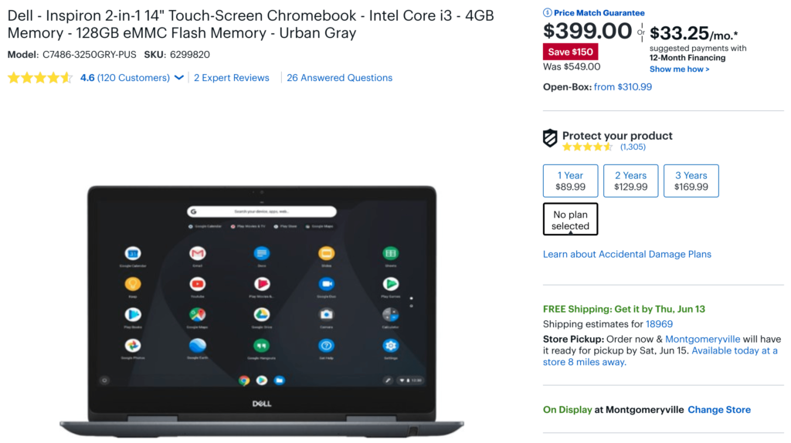
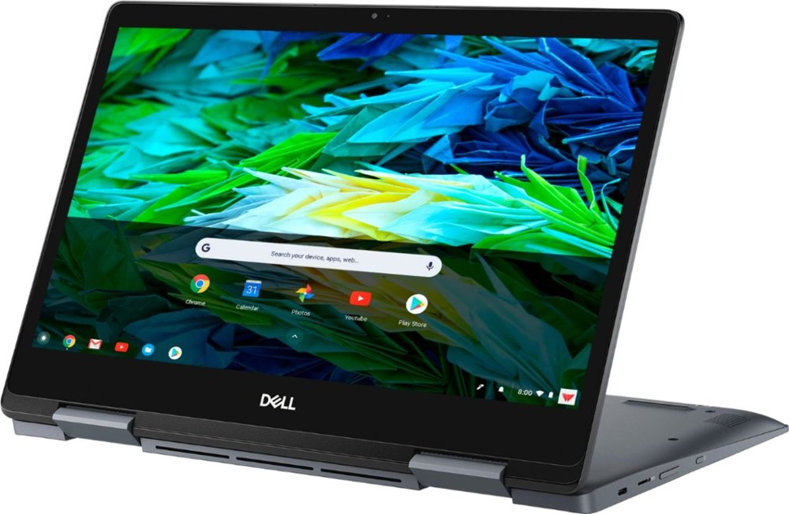

While the [Dell Inspiron Chromebook 14](https://www.aboutchromebooks.com/news/dell-insipiron-14-chromebook-price-release-date-availability/) isn't what I'd call a super high-end 2-in-1, it's definitely above the typical mid-range category thanks to the 8th-generation Core i3 U-series processor. And right now it's priced like a below mid-range Chromebook: You can save $150 and [get this laptop for $399 at Best Buy](https://www.bestbuy.com/site/dell-inspiron-2-in-1-14-touch-screen-chromebook-intel-core-i3-4gb-memory-128gb-emmc-flash-memory-urban-gray/6299820.p?skuId=6299820).

[Android Police spotted this deal](https://www.androidpolice.com/2019/06/12/dell-inspiron-chromebook-14-drops-to-399-150-off-at-best-buy/), which is a solid one if you're on a budget but don't want to skimp too much on performance. Here’s a rundown of the specs:

- [Intel Core i3-8130U](https://ark.intel.com/content/www/us/en/ark/products/137977/intel-core-i3-8130u-processor-4m-cache-up-to-3-40-ghz.html) processor
- Intel UHD 620 integrated graphics
- 4 GB of memory
- 128 GB of eMMC storage and microSD card slot
- 14.0-inch FHD (1920 x 1080) TrueLife LED Backlight Touch IPS Display with EMR Pen Support (pen included)
- 720p webcam
- Two USB Type-C ports, one USB Type-A port, microphone/headphone jack
- 802.11ac Wi-Fi and Bluetooth 4.2
- 56 WHr battery and 45 Watt charger
- Weight of 3.99 pounds

Back in April, the Dell Inspiron Chromebook was on sale for $499, which I think is more appropriate than the regular price of $549, currently through Dell directly.

With the U-series chipset, this Chromebook can run longer under a heavy processor load before it has to throttle back on speed to reduce heat. Of course, the U-series chips also use a fan to help mitigate overheating and slowdowns, so if you prefer a fanless device, this isn't for you.

If you don't mind that, however, $399 gets you a strong performing Chromebook with 1080p display and pen support, capable of fast browsing, multiple Android apps and even some Linux software if you decide to enable that option.
