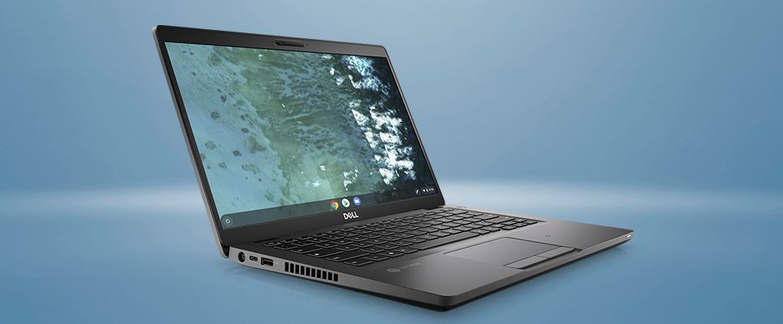
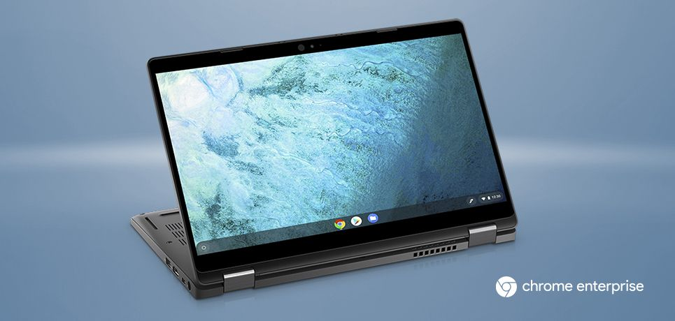

When [Google and Dell announced the new Latitude Chromebook Enterprise devices](https://www.aboutchromebooks.com/news/google-chrome-enterprise-devices-dell-latitude-5400-5300-chromebook/) on Monday, specs and pricing details were a little light. As of today, however, we can get a good look at those details as Dell has begun selling an initial three configurations each of the Latitude 5300 and 5400 Chromebook Enterprise laptops, with the least expensive coming in at $1,298.99.

Keep in mind that over time these Chromebooks will available is many more configurations. And also remember that the devices aren't intended for consumer purchases, which is why you may see some sticker shock: Enterprises have far fatter wallets and some of the options that increase pricing are for Dell / VMware services.

Starting with the [clamshell Dell Latitude Chromebook 5400](https://www.dell.com/en-us/work/shop/dell-laptops-and-notebooks/latitude-5400-chromebook-enterprise/spd/latitude-14-5400-chrome-laptop), here's what you get with the current model at the above-mentioned price:

- 8th Generation [Intel Core i5-8365U](https://ark.intel.com/content/www/us/en/ark/products/193555/intel-core-i5-8365u-processor-6m-cache-up-to-4-10-ghz.html) processor (with cooling fan)
- Intel UHD Graphics 620
- 14-inch 1920 x 1080 anti-glare non-touch display
- 8 GB of memory
- M.2 256GB PCIe NVMe storage and SD card reader
- 802.11ac Wi-Fi
- 2 USB 3.1 Gen 1 with PowerShare
- 1 USB Type-C 3.1 Gen 2 with Power Delivery & DisplayPort
- 1 HDMI port
- 1 USB 3.1 Gen 1 
- 1 RJ-45
- Backlit keyboard
- Optional HD RGB Camera with Dell Privacy Shutter
- 68 WHr battery
- Weight: 3.24 pounds

As previously mentioned, there will be other configurations that will increase or decrease the total cost. For example, you can drop the display down to 1366 x 728 resolution and run the Chromebook on an Intel Celeron 4305U processor; I suspect that's the model with the $699 starting price that Dell mentioned.

Or you can bump the price with an Intel Core i7-8665U chipset, add a touchscreen, increase RAM to 32 GB and boost storage up to 1 TB if you want. I'd guess that's a Chromebook costing well above $2,500.

For the [2-in-1 Dell Latitude Chromebook 5300](https://www.dell.com/en-us/work/shop/tablets-and-2-in-1-laptops/latitude-5300-2-in-1-chromebook-enterprise/spd/latitude-13-5300-2-in-1-chrome-laptop), you'll get mostly the same specs but pay more for a few extras: The initial model on sale costs $1,479 but comes with a 13.3-inch touch display, includes the HD webcam and sheds a quarter-pound of weight.

Both models are LTE capable for wireless connectivity on the road, of course. Note that while there's no mention of Bluetooth for either Chromebook, the [Intel Wireless-AC 9560 chip does support Bluetooth 5](https://www.intel.com/content/www/us/en/products/docs/wireless-products/dual-band-wireless-ac-9560-brief.html).

As with the clamshell version, you can configure the 2-in-1 with a full range of options: 8th-gen Intel processors from Celeron to Core i7, have between 4 and 32 GB of memory and choose between 128 and 512 GB of NVMe storage.

Again, these are enterprise devices, so pricing is far higher than a consumer might expect to pay. And although there have been Chromebooks for business in the past, these appear to be the first ones designed for enterprise use. That's partly because of some high-end configuration options not found on consumer devices and also due to the integrated endpoint device management services Dell is adding to the Chromebooks.

If nothing else, Dell and Google have created an offering where enterprises can't consider these Chromebooks merely "toys". These are very capable in terms of hardware. And if a large business has many employees working in web apps or developers / IT admins that can use Linux to get their work done, the new Dell Latitude Chromebook Enterprise line could be big business. We'll have to watch and see.
