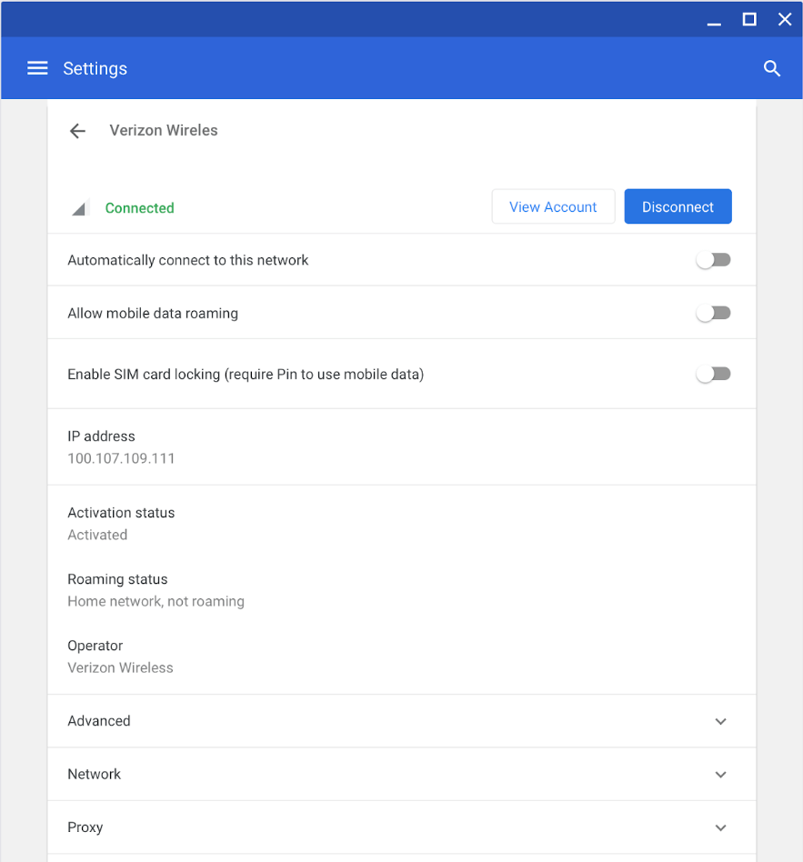
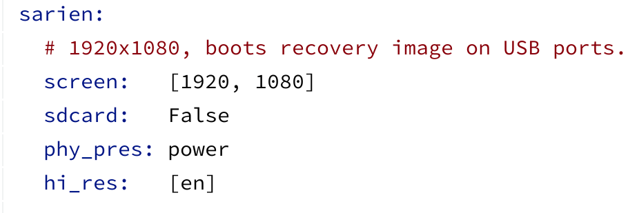

Back in February, I noted that the still-in-progress [Chromebooks code-named Sarien and Arcada could support an LTE radio](https://www.aboutchromebooks.com/news/lte-chromebook-sarien-arcada/). Now, thanks to some screenshots for LTE testing by the Chromium team that "could" changes to a "will": Sarien - and likely its sibling Arcada - will have LTE support inside.

A [recent bug in the Chromium tracker](https://bugs.chromium.org/p/chromium/issues/detail?id=924237) showed a few screenshots of the testing, which is related to the addition of a mobile network roaming toggle for LTE-enabled Chromebooks. The one below is from a Samsung Chromebook Pro V2 with LTE while the above image is from Sarien.

Chrome OS wireless settings with a new mobile data roaming option

Code to support [LTE modem firmware updates was added to both Sarien and Arcada back in May](https://www.aboutchromebooks.com/news/sarien-arcada-chromebooks-integrated-4g-lte/), but this is the first evidence I've seen that moved from code possibilities to action network testing on either device.

While some Chromebook owners don't mind or prefer to use their LTE phone as a Wi-Fi hotspot, having integrated LTE on a Chromebook brings a key benefit. But it's not quite for the Chromebook.

Instead, it's for the _phone_: Since sharing a mobile web connection on a handset uses quite a bit of battery, having that connection integrated to a Chrome OS device won't suck the juice out of your phone.

As a refresher on Sarien and Arcada, here's a rundown of the likely features, form factors, and internals:

- Sarien and Arcada will be similar devices from the same brand.
- [Sarien appears to be a detachable device](https://chromeunboxed.com/sarien-could-be-the-next-flagship-detachable-chromebook/), similar to the Pixel Slate, using Intel Whiskey Lake processors; a step up from the current crop of Chromebooks using Kaby Lake refresh chips. I anticipate [Arcada to be a traditional 2-in-1](https://chromium-review.googlesource.com/c/chromiumos/overlays/board-overlays/+/1549337/3/overlay-sarien/chromeos-base/chromeos-config-bsp-sarien/files/model.yaml) using the same chipsets at this point.
- That brand has long been expected to be Dell and I did find [a Dell email address as a code reviewer for Sarien](https://chromium-review.googlesource.com/c/chromiumos/overlays/board-overlays/+/1650562) from earlier this month.
- Expect a Wacom digitizer and stylus support.
- Based on a code commit, shown below, these related devices are likely to have 1080p touchscreen displays but not an SD memory card slot. Given that these are either 1080p detachables or 2-in-1s for tablet mode, I'll guess at a screen size between 12 and 14 inches to keep the pixel density relatively high.

