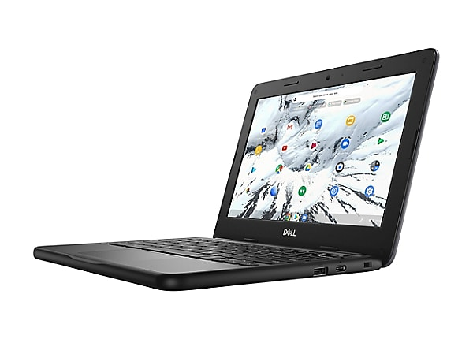
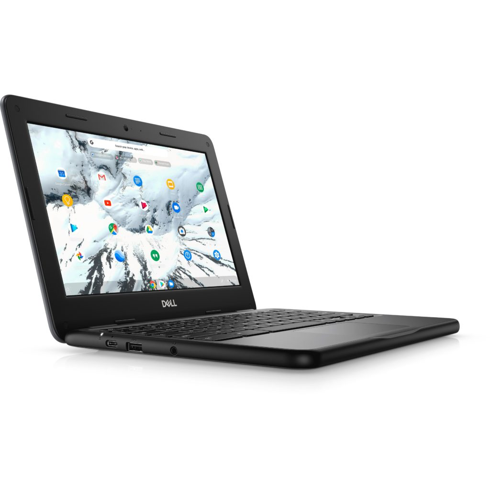

Early this week, I said [I didn't expect much from Dell in the way of Chromebooks at CES](https://www.aboutchromebooks.com/news/why-ces-2021-may-not-be-an-exciting-show-when-it-comes-to-chromebooks/). However, there is a small bit of news from the company today. The Dell Chromebook 3100 aimed for education that's been around for roughly two years is getting an integrated LTE radio option. This is fantastic news for schools and students that may not have a reliable Wi-Fi network at all times.

Inside the Dell Chromebook 3100 is Intel Celeron N4000 processor found in the original model. You'll also get 4 GB of memory and either 16 or 32 GB of local storage.

The older Chromebook 3100 clamshell can be configured with more memory or storage, but not the model with LTE. At least not yet. And if you go for the LTE model, you lose one of the two USB Type-A ports, which is an odd choice. I'd take LTE over that port though; an inexpensive USB hub can fit the bill for extra peripherals. The LTE version also loses its microSD card slot, which is a real shame.

The Dell Chromebook 3100 has been a staple for many students and educators, partly because of its low starting price of $269 and also because of its ruggedized construction. That doesn't change with the updated LTE configuration, although Dell hasn't yet announced the price of this configuration.

I'd look for at least an $80 premium over the Chromebook 3100 base model, which would still keep the entry price under $400. The company says we'll hear more details on pricing and availability in the coming months.

