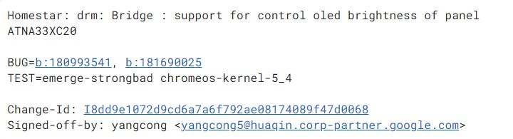
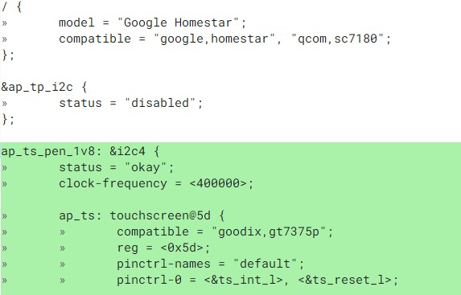
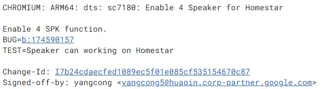
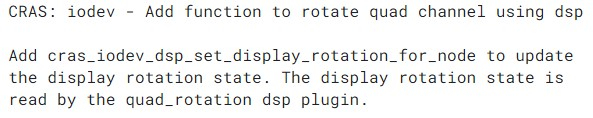

Back in February, [Chrome Unboxed reported on a new detachable, internally dubbed Homestar](https://chromeunboxed.com/chromebook-tablet-snapdragon-7c-homestar-coachz-strongbad). Since there wasn't much information then, I've been watching and waiting for more code changes on this device. Over the past few weeks, I've seen quite a few. From them, it's easy to deduce key bits about Homestar, an OLED Chromebook with [Snapdragon 7c](https://www.aboutchromebooks.com/tag/snapdragon-7c/ "Snapdragon 7c") and USI stylus support.

First, let's dig into code commits for the display itself, which is a Samsung OLED panel with model number ATNA33XC20. I haven't been able to find many details about the panel itself, so I suspect it's relatively new. There's a Samsung ATNA33xC11 OLED panel in the Asus ZenBook 13 UM325, so clearly we're on the right track here.

Evidence of this [OLED panel for Homestar is shown in the following code commit](https://chromium-review.googlesource.com/c/chromiumos/third_party/kernel/+/2793105), clearly spelled out:

As far as confirmation of the Qualcomm Snapdragon 7c (aka sc7180) powering Homestar, we can see that as well as [support for a touch panel controller with USI stylus support here](https://chromium-review.googlesource.com/c/chromiumos/third_party/kernel/+/2793108/1). The controller is a [Goodix GT7375p, which appears on the USI certification site](https://universalstylus.org/product-showcase/product-submission/gt7375p/).

Making this detachable even more interesting, at least to me is that it will have quad-speakers. That's much better than the mediocre stereo speakers on currently available Chrome tablets or detachables.

The four-speaker experience on a tablet device is quite good based on my usage of an iPad Pro 11 because the speakers rotate the sound to match display rotation. [Based on this code](https://chromium-review.googlesource.com/c/chromiumos/third_party/adhd/+/2812624) and its comments, developers are working on the same functionality for Homestar as the first Chromebook to do so.

According to code commits, [a Maxim Integrated MAX98357A Class D amplifier](https://www.maximintegrated.com/en/products/analog/audio/MAX98357A.html "https://www.maximintegrated.com/en/products/analog/audio/MAX98357A.html") is used with the sound and it does support one or two stereo pairs of speakers. Output volume is rated at 15db.

Other odds and ends I see so far [reading through this code](https://chromium-review.googlesource.com/c/chromiumos/platform/ec/+/2805224/2/board/homestar/board.c#323) include a pair of USB Type-C ports (something most Chrome tablets don't have) and both accelerometer and gyroscope support, as you'd expect.

That's about all I could sleuth at this time, but progress seems to be moving rapidly. Homestar should have an Engineering Validation Test, or EVT build, later this month. That's the first time a complete "package" will be testable but it's not like an end unit Chromebook in that state. The EVT stage is basically to check all of the hardware engineering and the code that supports it.

Keep in mind that we already know much about the [Qualcomm Snapdragon 7c compute platform](https://www.qualcomm.com/products/snapdragon-7c-compute-platform). It has an 8-core CPU up to a 2.4 GHz clock cycle per core, 802.11ac Wi-Fi, and Bluetooth 5.0 support as well as an integrated GPS radio and LTE modem. It also supports 60 Hz displays up to 1440p resolution although my gut says Homestar will have a 1080p screen.
