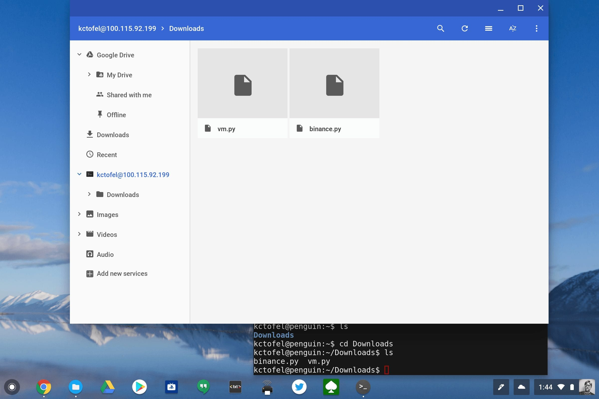

As of the time of this writing, there's no public announcement on a Chrome OS Dev Channel update today, but one appeared on my Pixelbook. It's version 68.0.3437.0 and the good news is that it fixes the Terminal app for Linux if you're running the Project Crostini containers.

For the past two weeks or so there have been some issues -- which you'd expect -- as new Dev Channel releases have rolled out: One of which brought up a blank, useless terminal. There was [a workaround to access your Linux container](https://www.aboutchromebooks.com/news/cant-open-your-project-crostini-container-terminal-heres-how-to-get-access/) in this case. However, the good news is that those workarounds aren't needed any more; at least not for now -- I bookmarked the workaround commands in case the Terminal blows up in the future.

[Crosfan on Reddit](https://www.reddit.com/r/Crostini/comments/8ltrs3/24may_dev_update_68034370_official_build_dev_64bit/) configured a URL to [show the release note changes for Dev Channel 68.0.3437.0](https://chromium.googlesource.com/chromium/src/+log/68.0.3431.0..68.0.3437.0?pretty=fuller&n=10000) and notes that along with the Terminal fix, several efforts to [mount the Linux files on the Chrome OS Files app](https://www.aboutchromebooks.com/news/how-the-chrome-os-files-app-will-support-linux-files-for-project-crostini/) are in the code as well.

It's still not an automatic mount, so [the SSH approach](https://www.aboutchromebooks.com/how-to/how-to-mount-linux-container-files-in-the-chrome-os-files-app-for-project-crostini/) that I outlined prior is still needed and works.

**Update**: Actually, it _**is**_ an automatic mount provided you enable the #crostini-files flag in chrome://flags. I didn't have that enabled but thanks to DennyL's comment, I tried it and it works!
