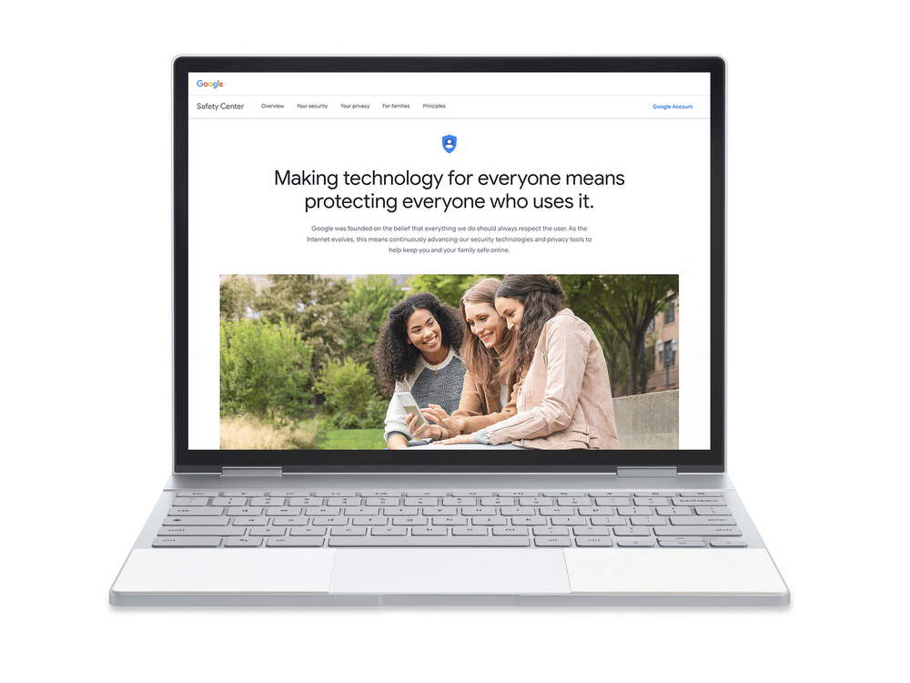

And we can add another image of a new Pixelbook with smaller bezels into the mix, just a few weeks prior to Google's official hardware event on October 9. Only this one comes from an unexpected source: Google itself!

The above image was used on September 21 on Google's own blog, [spotted by Redditor Onesneakymofo](https://www.reddit.com/r/chromeos/comments/9ivhhz/is_this_the_updated_pixelbook_found_on_a_google/) -- I don't make the names up, I just report 'em -- in a [post about the new Google Safety Center](https://www.blog.google/technology/safety-security/safety-center-helping-you-stay-safe-online/). And although device images often have renders of what's on the screen, I've never seen Google goof that up by using a larger screen image on a device in the past.

Here's the full image:

The Pixelbook shown in the blog posts has the same small bezels we've already seen [in a YouTube TV ad](https://www.aboutchromebooks.com/news/pixelbook-2-youtube-tv-ad-smaller-bezels-madebygoogle-eve-campfire/) as well as [ad spots on Facebook](https://www.aboutchromebooks.com/news/pixelbook-2-leak-smaller-bezels-madebygoogle-chromebook/). Sure it could be a coincidence but if it is, it's definitely an odd one. And given the prior leaks, I almost feel like Google let this one slip by on purpose since there have been so many leaks of the upcoming Pixel phones.

Maybe Google will be poking fun at itself on October 9, but if the new Pixelbook has smaller bezels, possibly [a 3000 x 2000 higher resolution display](https://www.aboutchromebooks.com/news/nocturne-chrome-tablet-screen-resolution-specs-pixelbook-3000x2000/) and newer 8th-gen Intel processors to power Chrome OS [and other operating systems](https://www.aboutchromebooks.com/news/project-campfire-alt-os-dual-boot-windows-10-chromebooks-linux/), Google might be laughing last... all the way to the bank!
